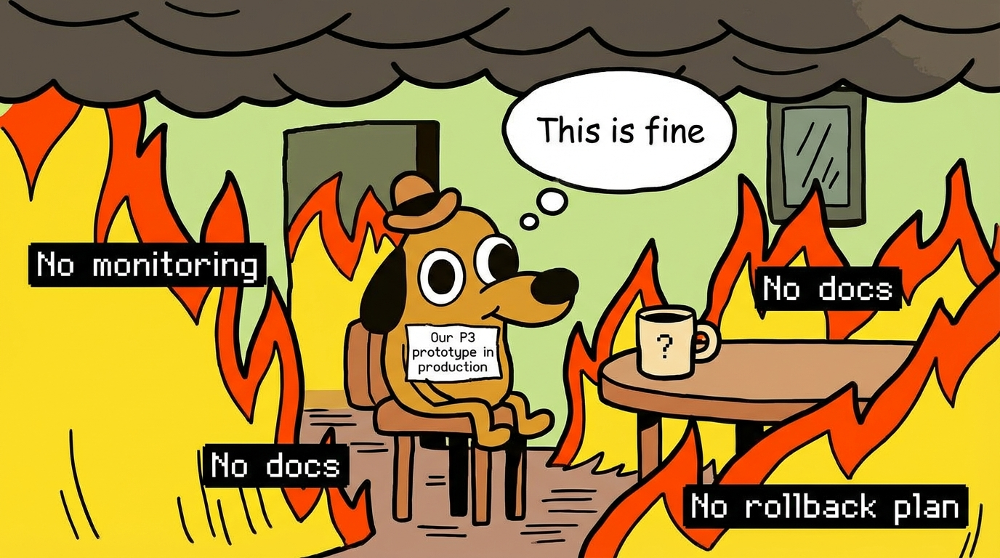
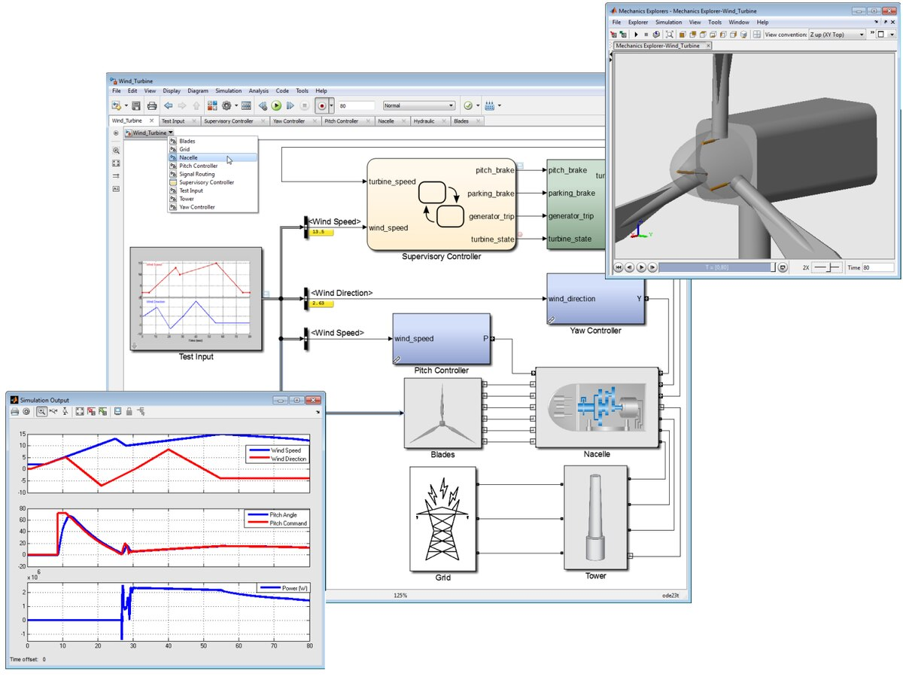
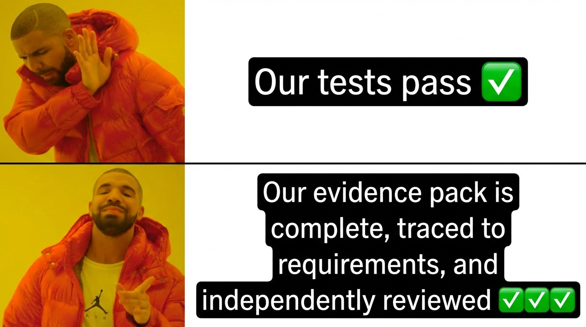
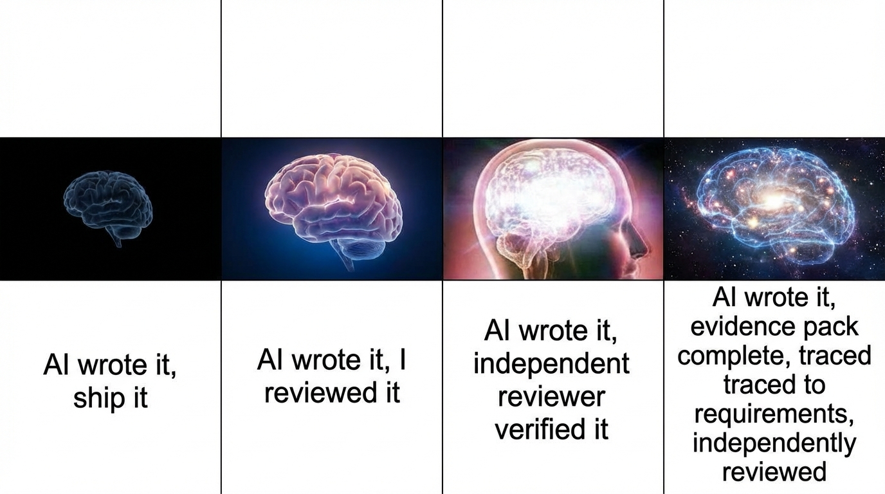
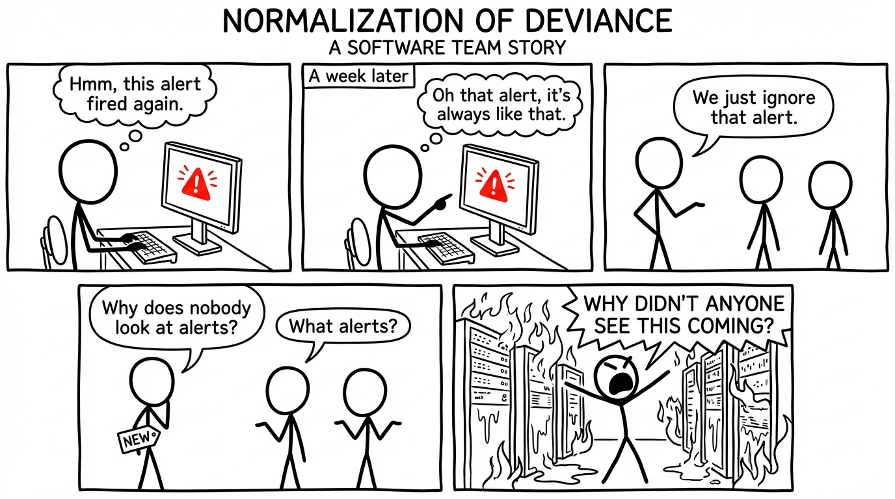
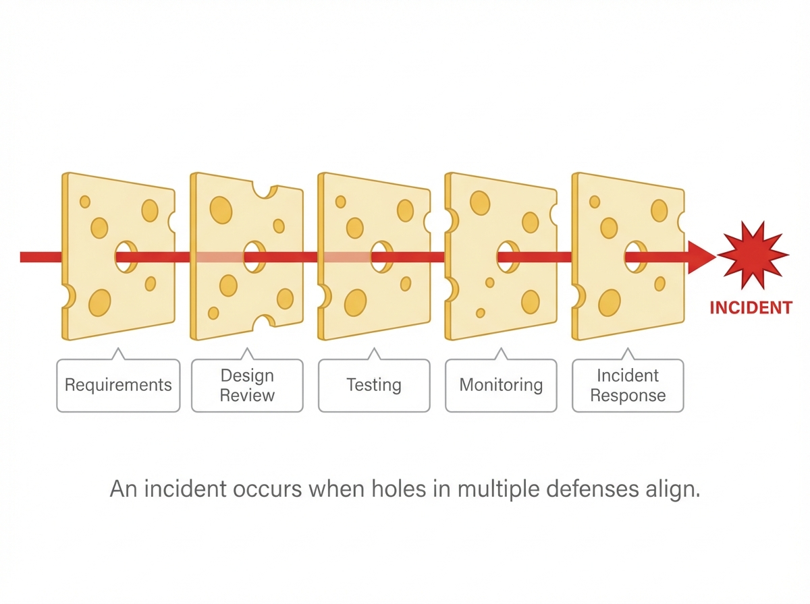
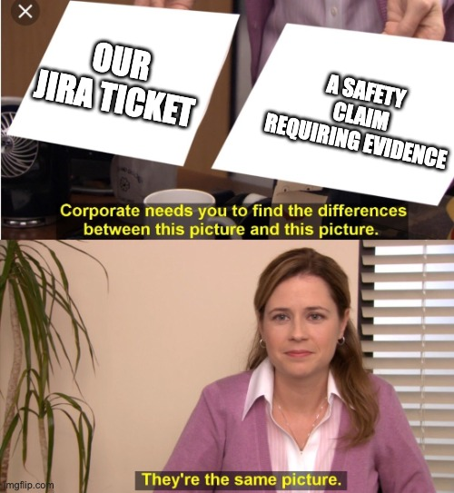

<!-- _class: lead -->

# High-Assurance Software in the AI Era

### What NASA, Automotive & Safety-Critical Engineering Can Teach Your Team

**Leonid Bugaev**
March 2026


<!--
Speaker notes:
[Look at audience] [with energy] Welcome, everyone. **[Pause]**

[Hook] How many of you shipped code this week that you are not 100% sure is correct? **[Pause — let hands go up]** Yeah. All of us.

Today we are going to steal — shamelessly — from the people who figured this out decades ago. NASA. The car industry. Aviation. **[Slow down]** By the end of this hour, you will see direct, practical links between how they build software and what we do every day in API management.

[Key point] The goal is NOT to turn us into NASA. The goal is to grab the best ideas from people whose software literally cannot fail — and use those ideas in our work.

[Change pace] Let me start with why this matters right now.
-->

---

# Voyager: The Ultimate Software Engineering Achievement


**Launched 1977.** Still running. Still communicating. **49 years of uptime.**

- **68 KB of memory** — less than this slide deck
- **~70,000 lines of code** — updated remotely from 24 billion km away
- Software patched **in flight** — including a fix in 2023 for a memory corruption bug
- Zero option for "roll back" or "redeploy"
- Every line of code was reviewed, tested, and traced to a requirement

**Our goal as software engineers:** build systems with this level of intentionality — not because we're going to Jupiter, but because the principles that got Voyager there are the same ones that make any software trustworthy.

<!--
Speaker notes:
[with awe] Let me start with the greatest software engineering achievement in human history. **[Pause]**

Voyager 1 was launched in 1977. It is now 24 billion kilometers from Earth. And it is still running. Still sending data back. 49 years of uptime.

[Slow down] Think about that. 68 kilobytes of memory. Less than this slide deck. About 70,000 lines of code. And here is the incredible part — that software has been PATCHED remotely. In 2023, NASA engineers fixed a memory corruption bug on a spacecraft 24 billion kilometers away. The signal takes 22 hours to reach it.

[Key point] There is no "let me just restart the server." No rollback. No hotfix in 5 minutes. Every change is verified, tested, simulated, and reviewed — because failure is not an option.

[Look at audience] Our goal is not to build spacecraft. But the principles that made Voyager possible — intentional design, formal requirements, evidence-based testing, traceability — those are exactly what make ANY software trustworthy. That is what we are here to learn today.
-->

---

# Why This Talk?

> "AI made software faster. It did not make it more trustworthy."

- AI generates code very fast
- But our **trust** in that code did not grow at the same speed
- The hard part changed: **writing code → knowing the code is correct**
- Safety-critical industries solved this problem decades ago

<!--
Speaker notes:
[matter-of-fact tone] Here is the uncomfortable truth. **[Pause]**

[Hook] Raise your hand if you can write code faster today than you could two years ago. **[Pause]** Of course. AI made all of us faster. But here is the question nobody is asking enough — **[Slow down]** did your TRUST in that code grow at the same speed? **[Pause]**

Writing code was never the hard part. The hard part was always: how do we KNOW this code is correct, safe, and reliable?

[Key point] NASA, the car industry, and aviation have worked on this exact problem for over 40 years. They did not just hope their software was correct — they built systems to PROVE it. They built justified trust. **[Look at audience]** And we can learn from them.

[Change pace] But first, let me address the elephant in the room...
-->

---

# The Identity Question

<!-- _class: small -->

AI is challenging what it means to be a software engineer. **This happened before.**

In the 1990s–2000s, aerospace introduced **auto-generated code** — SCADE/Simulink produced C from visual models. Engineers worried: *"the machine is writing our code!"*

**What actually happened:**
- GN&C engineers stopped writing C, started designing control systems visually
- Flight software engineers still write C/C++ by hand — with formal requirements and verification
- New roles emerged: requirements engineers, IV&V specialists, verification architects
- **Nobody disappeared. The job moved up the stack.**

| What auto-generation replaced | What engineers STILL do (and always will) |
|---|---|
| Typing C from equations | Deciding WHAT the system should do |
| Translating math to code | Classifying risk and consequences |
| Manual coding of control loops | Writing requirements precise enough to verify |
| | Proving correctness — building the evidence |
| | Taking accountability for the result |

> AI is doing the same shift now. **Your value was never in typing syntax — it was in knowing what to build and proving it works.**

<!--
Speaker notes:
[Look at audience] [with conviction] Before we dive in, I want to address something that is on everyone's mind. **[Pause]**

[Hook] How many of you have wondered — even for a second — whether AI will replace you? **[Pause — let the silence sit]** Yeah. Aerospace already answered that question. Twenty years ago.

In the 1990s and 2000s, the aerospace industry introduced automated code generation. SCADE and Simulink could produce certified C code directly from visual models. GN&C engineers — Guidance, Navigation, and Control — stopped writing C by hand. They design control systems visually in Simulink, and the tool generates the code.

**[Slow down]** But here is the important part: flight software engineers STILL write C and C++ by hand. The Mars rover code, the Orion capsule, James Webb — all hand-written.

[Key point] Auto-generation did not eliminate engineers. It split the field: some moved to higher-level design, others stayed hands-on but with much better tooling and verification. **[Gesture to slide]** New roles appeared that did not exist before: requirements engineers who formalize specifications, IV&V specialists who independently verify, verification architects who design the evidence strategy. Nobody disappeared. The job moved up the stack.

[Change pace] AI is doing the same thing now. It is replacing the lowest-value part of engineering — typing syntax — and amplifying the highest-value part: deciding what to build, proving it works, and taking accountability.

[Look at audience] For those of you working with banks — and I know some of you are — this is especially relevant. **[Slow down]** Regulators will never accept "the AI wrote it" as evidence of correctness. Someone has to sign off. Someone has to build the trust chain. That someone is the engineer — just with a different job description than five years ago.

[~60 seconds on this slide — it is worth the time]
-->

---

# What Is "High Assurance"?

It is **NOT**:
- Zero bugs
- Extra paperwork
- "Normal software with more testing"

It **IS**:
- Careful control of **what can go wrong**
- An **evidence system** — you show proof that things work, not just hope
- Every claim about the system has supporting proof

<!--
Speaker notes:
[with enthusiasm] Let me clear up the biggest misunderstanding right now. **[Pause]**

[Hook] If I say "high assurance," what do you hear? Zero bugs? Paperwork? Slow releases? **[Pause]** Wrong on all three.

[Key point] **[Slow down]** NASA software has bugs. Cars have bugs. The difference is: they know WHERE bugs matter most, they have PROOF that their critical paths work, and they have processes to catch problems before bad things happen.

[Look at audience] It is about spending your effort where it matters most — not everywhere equally.

[Change pace] And the way they organize all of this? One simple loop.
-->

---

<!-- _class: lead -->

# The Core Loop

## Claim → Control → Evidence → Decision

<!--
Speaker notes:
[Look at audience] [matter-of-fact tone] Everything — and I mean everything — in high-assurance engineering comes back to this one loop. **[Pause]**

**[Gesture to slide]** You make a CLAIM about your system: "Authentication cannot be bypassed." You set up CONTROLS: code review, testing, monitoring. You collect EVIDENCE: test results, coverage reports, review records. Then you make a DECISION: "We have enough proof to release."

[Key point] **[Slow down]** This is the heartbeat of safety engineering. Every single practice we discuss today connects back to this loop. Claim. Control. Evidence. Decision.

[Change pace] Now let me show you the difference this makes in practice.
-->

---

# Two Worlds Compared

| Ordinary Software | High-Assurance Software |
|---|---|
| "Does it work?" | "What **claim** are we making?" |
| Code is the product | Code + proof + traceability |
| Team reviews itself | **Independent** reviewer built in |
| Release = business decision | Release = **risk-acceptance** event |
| Tests give confidence | Tests produce **proof** |
| Incidents are fires to fight | Incidents are **lessons** |

<!--
Speaker notes:
[Gesture to slide] Look at these two columns. **[Pause]**

[Look at audience] [Hook] Be honest — which column does your team live in? **[Pause]** Yeah. We all live on the left. We ship when the product manager says go, we test until we feel good enough, we review our own code.

**[Slow down]** The right column is not about being slow — it is about being careful where it matters.

[Key point] You do NOT need to use the right column for everything. You use it only where failures have serious consequences. **[Pause]** That single idea — rigor proportional to risk — is what separates safety engineering from bureaucracy.

[Change pace] But first, let me put our problems in perspective. Because we complain a lot about our staging environments...
-->

---

# Think Your Staging Environment Is Bad?

You: *"Our staging doesn't match production..."*

NASA: **"Our production is launching a spacecraft into space. There is no staging."**

| Your problem | NASA's problem |
|---|---|
| "Can't run tests locally" | Can't run tests on Mars |
| "Staging has stale data" | Staging is a vacuum chamber that costs $100M/hour |
| "We'll hotfix in production" | Production is 200 million km away, 20-min signal delay |
| "Let's just rollback" | There is no rollback. The rocket already launched. |
| "Our CI is slow (8 min)" | Their full test campaign takes **months** |

> That's WHY they invested 40 years in getting it right before launch. When your production is space, your process had better be bulletproof.

<!--
Speaker notes:
[with dry humor] Before we go into the details, let me put our problems in perspective. **[Pause]**

[Gesture to slide] **[Slow down]** We complain about our staging environments not matching production. NASA's production is literally launching things into space. **[wait for reaction]**

[with increasing emphasis] You cannot SSH into the Mars rover and hot-fix a config file. The signal delay to Mars is 4 to 24 minutes ONE WAY. If your code has a bug, the spacecraft is already dead by the time you see the error log. There is no rollback for a rocket. There is no canary deployment for a Mars landing. **[Pause — let the table sink in]**

[Key point] **[Slow down]** That is the fundamental reason they invested 40 years building the processes we are about to learn. When your production environment is space, you MUST get it right before launch.

[Look at audience] [Change pace] And here is the thing — the practices they developed to handle this extreme constraint? They work just as well for our much simpler problems. If you can verify software that flies to Mars, you can definitely verify an API gateway.

[~45 seconds on this slide — the humor lands well, give it time]
-->

---

# Voyager: What Great Software Engineering Looks Like

<!-- _class: small -->
<style scoped>table { font-size: 0.78em; } p { font-size: 0.88em; }</style>


| Fact | |
|---|---|
| **Launched** | 1977 — 48 years ago |
| **Still operating** | Both Voyager 1 and 2 are active in interstellar space |
| **Distance** | 24+ billion km from Earth (light takes 22+ hours to reach it) |
| **Computer** | 69 KB of memory. Your phone has 6 million times more. |
| **Software updates** | Engineers have patched the code remotely — from 24 billion km away |
| **Last major fix** | 2023 — fixed a memory corruption bug, craft resumed science operations |

**The software was written so well that it is still running — and still fixable — after 48 years.**

> Our goal as software engineers: **build Voyagers.** Systems so well-designed, so well-documented, so well-verified that someone can understand, maintain, and fix them decades later — even from 24 billion km away.

<!--
Speaker notes:
[Pause — let the image sink in] **[Look at audience]**

[with awe, slow pace] Voyager 1 is the most distant human-made object in existence. It is over 24 billion kilometers from Earth. A radio signal takes more than 22 hours to reach it — one way. **[Pause]**

**[Slow down]** It was launched in 1977. The software was written in assembly language, running on a computer with 69 kilobytes of memory. [Look at audience] Your phone has six million times more memory than Voyager's computer.

And here is the remarkable thing: it is STILL running. Both Voyager 1 and Voyager 2 are still active, still sending data, still being maintained. **[Pause]** In 2023 — forty-six years after launch — engineers at JPL diagnosed a memory corruption bug, wrote a patch, uploaded it from 24 billion kilometers away, and Voyager resumed science operations.

**[Pause — let that land]** [with conviction]

Think about that. Software written nearly five decades ago, on hardware we would consider laughably primitive, is still running and still fixable. Not because the hardware is magic — because the engineering was excellent. The requirements were clear. The code was well-documented. The verification was thorough. The design was modular enough that someone who was not born when it launched can understand it and fix it today.

[Key point] **[Slow down]** [Look at audience] That is our goal. Not just code that passes tests today — but systems so well-designed that they can be understood, maintained, and fixed decades later. Build Voyagers.

[~60 seconds on this slide — this is an emotional anchor, do not rush it]
-->

---

# A $125 Million Requirements Bug

**Mars Climate Orbiter (1999)**

- Lockheed Martin software: sent thrust data in **pound-force seconds**
- NASA navigation software: expected **newton seconds**
- Nobody checked the unit agreement between teams
- The spacecraft entered Mars atmosphere too low and was destroyed

> One missing line in an interface specification. $125 million lost.


<!--
Speaker notes:
[Change pace — storytelling voice] Let me tell you a story. **[Pause]**

In 1999, NASA lost the Mars Climate Orbiter — a 125 million dollar spacecraft. **[Pause]** The reason? [with disbelief] One team used imperial units, another used metric units, and nobody checked that the two sides agreed.

[Look at audience] It was not a hard bug to find. A junior engineer could have caught it. It was a requirements problem — the interface between two systems was not clearly specified.

[Key point] **[Slow down]** This is exactly the kind of failure that high-assurance practices prevent. Not with more testing — but with clear requirements and traceability. **[Gesture to slide]** One missing line in an interface spec. 125 million dollars. Gone.

[Change pace] Which brings us to the most important idea in this entire talk.
-->

---

<!-- _class: lead -->

# Part 1: Classify Before You Engineer

### "Rigor is proportional to consequence, not complexity"


<!--
Speaker notes:
[Look at audience] **[Pause — this is a breathing moment]**

[Key point] **[Slow down]** [with conviction] This is the single most important idea from today. If you forget everything else, remember this: before you decide HOW to build something, decide HOW CRITICAL it is.

A 100-line authentication module might need more checking than a 10,000-line dashboard. NASA understood this and created a classification system. **[Change pace]** Let me show you.
-->

---

# NASA Software Classes

| Class | Description | Example | Rigor |
|---|---|---|---|
| **A** | Human-rated, loss of crew | Flight software | Full IV&V*, formal methods |
| **B** | Mission-critical | Science instruments | IV&V*, extensive testing |
| **C** | Mission-support | Ground systems | Standard V&V |
| **D** | Support | Admin tools | Basic testing |
| **E*** | Exploratory | Prototypes | Minimal |

> **Rule:** Lower-class software cannot silently become operational. If it does, it must be reclassified and upgraded.

*\* Class E is used informally; NPR 7150.2D formally defines A–D*
*\* IV&V = Independent Verification & Validation — a separate team with its own tools, management, and budget*

<!--
Speaker notes:
[Gesture to slide] NASA classifies every piece of software from A to E. **[Slow down]** Class A means crew safety — think flight software on the Space Station. Class E is a quick prototype.

[Key point] The critical rule — and pay attention to this one: software cannot silently move up. If your "quick prototype" becomes a production service, you MUST reclassify it and upgrade the rigor.

[Hook] [Look at audience] Does this sound familiar? **[Pause]** How many of our "temporary" solutions are currently running in production? **[wait for knowing laughter]**

[Change pace] The car industry took this even further with a formula...
-->

---

# Automotive: ASIL Levels

**ISO 26262** uses three factors:

| Factor | Question |
|---|---|
| **Severity** | How bad if it fails? (S0–S3) |
| **Exposure** | How often is the scenario encountered? (E0–E4) |
| **Controllability** | Can the driver/user recover? (C0–C3) |

**→ ASIL A** (lowest) through **ASIL D** (highest)

ASIL D: Steering failure at highway speed — catastrophic, frequent exposure, hard to control

<!--
Speaker notes:
[matter-of-fact tone] The car industry took a more mathematical approach. **[Gesture to slide]** They look at three things: how bad is the failure, how often does the situation happen, and can the driver recover?

Multiply those together and you get an ASIL level from A to D. **[Slow down]** ASIL D means: if this fails, people die, it happens often, and the driver cannot do anything. Example: steering breaks at 120 km/h on the highway.

[Key point] [Look at audience] For us, the lesson is simple: not every API endpoint needs the same level of care. But you need a system to decide which ones DO.

[Change pace] So let me give you a simple system you can use starting tomorrow.
-->

---

# A Simple Classification: P0 → P3

| Level | What belongs here | Examples |
|---|---|---|
| **P0** | Security, data integrity, compliance | Auth, policy enforcement, audit trail |
| **P1** | Core business logic | Request handling, config delivery |
| **P2** | Supporting systems | Dashboards, telemetry, caching |
| **P3** | Experiments | Prototypes, internal tools |

**P0 → structured review, evidence packs, independent check**
**P3 → normal development process**

<!--
Speaker notes:
[with enthusiasm] Here is what this looks like in OUR world. **[Gesture to slide]**

[Slow down] P0 is anything where a failure means a security incident, data leak, or full outage. In API management, that is your authentication engine, your policy rules, your audit trail.

P1 is core work — routing, discovery. P2 is important but recoverable — dashboards, caching. P3 is experiments.

[Key point] [Look at audience] **[Slow down]** P0 gets NASA-level care. P3 gets normal development. You do not slow down everything — you invest effort where it truly matters.

[Hook] Think for a second — do you know which of your services are P0 right now? **[Pause]** If you had to pause and think, that is exactly the problem this solves.

[Change pace] Now, how do you actually find your hazards?
-->

---

# How to Find Your Hazards

**NASA's Preliminary Hazard Analysis (simplified):**

| Step | Question | Example |
|---|---|---|
| 1. **What can fail?** | List failure modes | Auth service returns wrong decision |
| 2. **How bad?** | Severity (S1–S4) | S4: unauthorized data access |
| 3. **How likely?** | Probability | Medium: happens under load |
| 4. **Risk = S × P** | Prioritize | **High** → needs controls |
| 5. **What controls?** | Mitigations | Independent auth check, rate limit, monitoring |

> Do this exercise once. It will show you risks you did not know you had.

<!--
Speaker notes:
[matter-of-fact tone] When we say "identify your top 5 hazards" in the adoption plan later — this is HOW you actually do it. **[Gesture to slide]**

NASA uses Preliminary Hazard Analysis. It sounds fancy, but it is five steps on a whiteboard. **[Slow down]** List what can fail. Rate the severity. Rate the probability. Multiply to get risk. Decide what controls are needed.

[Key point] You do not need special tools. A whiteboard and your team is enough. List failure modes for your P0 components. Rate them honestly. The highest risk items get the most controls.

[Look at audience] [with conviction] This one exercise — done honestly, with your team in a room — will change how you think about what you build. I guarantee it.

[~30 seconds on this — it is practical, keep it moving]
-->

---



<!--
🎨 AI IMAGE GENERATION PROMPT:
"This is fine" meme (dog sitting in burning room), but relabeled:
- The dog is labeled "Our P3 prototype in production"
- Fire/flames labeled: "No monitoring", "No tests", "No docs", "No rollback plan"
- Style: classic internet meme, simple, funny
Speaker notes:
**[Pause — let the audience read the meme]** [wait for reaction] [pause for laughter]

[Hook] [Look at audience] Raise your hand if you have a P3 prototype currently running in production right now. **[Pause]** [with dry humor] Yeah. We ALL do. **[pause for laughter]**

[Key point] [Change pace] [matter-of-fact tone] Let us fix that. Starting with understanding the standards landscape.
-->

---

<!-- _class: lead -->

# Part 2: The Standards Landscape
### A 5-minute world tour

<!--
Speaker notes:
**[Pause — breathing moment]** [Look at audience]

[Change pace] [matter-of-fact tone] Let me give you a quick five-minute tour of the major standards. You absolutely do not need to memorize these — I will share reference material after the talk. But knowing they exist and what they cover will help you understand where all these practices come from.
-->

---

# The Big Standards

| Domain | Standard | What it does |
|---|---|---|
| NASA | NPR 7150.2D | Software classes A–E |
| NASA | NASA-STD-8739.8B | Assurance & IV&V (Independent Verification & Validation) |
| Auto | ISO 26262 | Functional safety (ASIL A–D) |
| Auto | ISO 21448 (SOTIF) | Safety of intended function |
| Auto | ISO/PAS 8800 | AI in vehicles |
| Aviation | DO-178C | Software certification levels |
| Aviation | DO-330 | Tool qualification |

<!--
Speaker notes:
[Gesture to slide] [~30 seconds on this — scan the table, hit the highlights, do not read every row]

NASA has two key documents: NPR 7150.2D for software engineering requirements by class, and 8739.8B for assurance and independent verification.

The car industry has ISO 26262 for functional safety, SOTIF for cases when correct software is still unsafe — we will come back to that one — and ISO 8800 for AI in vehicles.

**[Slow down]** Aviation has DO-178C — probably the most influential safety software standard in the world — and DO-330 for tool qualification.

[Key point] [Look at audience] You do not need to memorize these. What matters is that these represent decades of hard-won lessons, and we are going to extract the best ideas from them.

[Change pace] Starting with traceability.
-->

---

# Traceability: The Chain of Proof

```
Requirement ──────▶ Design ──────▶ Code ──────▶ Test ──────▶ Monitor
     │                 │              │             │             │
     ◀─────────────────◀──────────────◀─────────────◀─────────────┘
                    (links go both ways)
```

**Every link must be traceable in both directions:**
- Requirement → which code implements it?
- Code → which requirement does it satisfy?
- Test → which requirement does it verify?
- Bug found → which requirement was violated?

> If you cannot trace from a bug back to a requirement, you have a gap.

<!--
Speaker notes:
[with conviction] This is one of the most powerful ideas from safety engineering. **[Gesture to slide]** **[Pause]**

Bidirectional traceability. Every requirement links forward to design, code, tests, and monitors. And every test links backward to a requirement.

[Hook] Think about this: if you find a bug in production right now, can you trace it back to the requirement that was violated? Can you find which test should have caught it and why it didn't? **[Pause]**

[Key point] **[Slow down]** Without traceability, you are guessing. With traceability, you have a chain of proof.

[Look at audience] In API management, think of it this way: if someone asks "how do we know key revocation works?" — you can follow the chain from requirement to test to monitor. No hand-waving. Just evidence.

[Change pace] Now here is a concept that blew my mind when I first learned about it...
-->

---

# SOTIF: When Correct Software Is Still Unsafe

**ISO 21448 — Safety of the Intended Functionality**

The system works **exactly as designed**... but is still dangerous.

| Traditional Safety | SOTIF |
|---|---|
| Bug causes wrong behavior | No bug — behavior is correct |
| Fix: find and fix the bug | Fix: improve the design itself |
| Example: sensor gives wrong value | Example: sensor works but cannot see in rain |

**Very relevant for AI:** model works as trained, but training data had gaps

> "The software did exactly what we told it to. We told it the wrong thing."

<!--
Speaker notes:
[with genuine curiosity] This is a concept many people miss, and it genuinely changed how I think. **[Pause]**

Traditional safety is about bugs: something broke, fix it. **[Slow down]** SOTIF asks a completely different question: what if the software works perfectly — exactly as designed — but the design itself is not safe enough?

[Hook] Think about it. A self-driving car camera works fine — but it cannot see in heavy rain. No bug. The sensor is correct. But the system is unsafe. **[Pause — let that sink in]**

[Key point] [Look at audience] This connects directly to the AI section we will see later. The model works exactly as trained, but the training data did not cover every situation. AI Copilot writes correct code — but for the wrong edge case. No bug in the tool. The gap is in what we asked for.

[matter-of-fact tone] Keep SOTIF thinking in the back of your mind. It will come back when we discuss AI governance.

[Change pace] Now let us get into the technical practices. Starting with requirements.
-->

---

<!-- _class: lead -->

# Part 3: Requirements as Contracts
### "Don't let behavior live only in prose or code"

<!--
Speaker notes:
**[Pause — breathing moment]** [Look at audience]

[Change pace] [with enthusiasm] Now let us get into the technical meat. I want to start with requirements — and this is the part that surprised me the most.

**[Slow down]** In safety engineering, unclear requirements are the single most expensive type of bug. NASA found that a requirements mistake caught late costs 100 times more to fix than one caught early.

[Key point] So they built a tool to fix this. Let me show you the problem first.
-->

---

# The Requirements Problem

**Typical requirement:**
> "The system shall handle authentication failures gracefully"

**What does this actually mean?**
- Return 401? 403? 500?
- Within what time?
- For all endpoints or just protected ones?
- What about partial failures?
- Log it? Alert on it?

> **NASA finding:** Most expensive defects originate in requirements ambiguity

<!--
Speaker notes:
[Gesture to slide] Look at this requirement. **[Pause]** [with dry humor] It sounds fine, right? "Handle authentication failures gracefully." Ship it. **[Pause]**

[Hook] But what does "gracefully" actually mean? Return 401? 403? 500? Within what time? For all endpoints? What about partial failures? **[Look at audience]** If I gave this to five developers, I would get five different implementations.

[Key point] **[Slow down]** In safety-critical systems, this kind of ambiguity causes real damage — like that 125 million dollar Mars orbiter we just talked about. NASA built a tool called FRET to solve this exact problem.
-->

---

# The Solution: SRS + FRET

<!-- _class: small -->
<style scoped>p { font-size: 0.92em; } table { font-size: 0.82em; }</style>

**The SRS (Software Requirements Specification)** is the authoritative document where every requirement has a unique ID, an owner, a priority, and a verification method. It covers everything: functional behavior, performance, interfaces, safety, design constraints, quality attributes. Think of it as the **single source of truth** for what the system must do — often hundreds of pages, version-controlled, change-tracked.

**FRET (Formal Requirements Elicitation Tool)** is NASA's open-source tool that takes the behavioral subset of the SRS and formalizes it into structured English that machines can check. FRET doesn't replace the SRS — it **augments** it.

| | SRS | FRET |
|---|---|---|
| **What it covers** | Everything — all requirement types | Only behavioral "shall" statements (~40-60%) |
| **Format** | English prose with unique IDs | Structured English → temporal logic (auto-generated) |
| **Verified how?** | Test, Analysis, Inspection, or Demonstration | Kind 2 proof + MC/DC tests + Copilot monitors |
| **Who writes it** | Systems engineers | Requirements engineers (translating from SRS) |

<!--
Speaker notes:
[~45 seconds on this — dense slide, guide the audience through the table]

[Gesture to slide] Let me introduce the two key documents. **[Slow down]**

The SRS — Software Requirements Specification — is the authoritative requirements document. Every requirement has a unique ID like FSW-REQ-0100, an owner, a priority, a verification method, and traceability to design and tests. Think of it as the contract between the requirements team and the development team.

[Change pace] FRET — NASA's Formal Requirements Elicitation Tool — takes the behavioral subset of the SRS and formalizes it. You write structured English in FRET: "when sensor A exceeds threshold, the FlightController shall within 1 cycle satisfy mode equals SAFE_MODE." FRET automatically generates temporal logic formulas.

[Key point] [Look at audience] But here is the practical reality — only about 40 to 60 percent of SRS requirements are candidates for FRET formalization. The behavioral ones with clear inputs, outputs, and timing. The rest stay as traditional SRS text. And that is fine.

[Change pace] Let me show you how these two documents work together.
-->

---

# How Requirements Flow: From SRS to FRET

<!-- _class: small -->

FRET **augments** the SRS — formalizing the behavioral subset:

| | Traditional SRS | + FRET formalization |
|---|---|---|
| **Format** | *"Enter safe mode upon anomalous readings"* | *"When sensor_A > threshold, shall satisfy mode = SAFE_MODE"* |
| **Ambiguity** | What's "anomalous"? How fast? | Explicit: variable, condition, timing, output |
| **Testable?** | Only after interpretation | Directly — the requirement IS the test spec |
| **Verifiable?** | No | Yes — Kind 2 proves it, Copilot monitors it |

Only **~40-60%** of SRS requirements are formalizable (behavioral "shall" statements with clear I/O/timing).

**One artifact, three consumers:** developer spec + MC/DC test spec + Kind 2 verification contract

> **"Questions back" loop:** translating SRS → FRETish forces resolution of every ambiguity. Those questions improve the SRS itself. Requirements defects caught early are orders of magnitude cheaper.

<!--
Speaker notes:
[~60 seconds on this — this is a critical concept slide, take your time]

[matter-of-fact tone] Let me be clear about something: FRET does NOT replace the SRS. It augments it. **[Gesture to slide]**

Only about 40 to 60 percent of functional requirements are candidates for FRET — those with clear triggers, components, timing, and behavioral responses. Safety requirements like "shall never fire opposing thrusters simultaneously" are almost always formalizable. But design constraints like "shall be written in C99"? Those stay as traditional SRS text.

[Change pace] **[Slow down]** Now here is the part that matters most. The translation from SRS to FRETish is a manual step done by a requirements engineer. They read "enter safe mode upon anomalous readings" and they have to decide: what does "anomalous" actually mean? Which sensors? What threshold? How fast?

[Key point] [with conviction] Those forced decisions generate questions BACK to the systems engineers. "Which sensors are primary? Is it 3 or more, or strictly more than 3?" The SRS gets updated with more precise language.

[Look at audience] This feedback loop — FRET forcing precision which improves the authoritative document — is arguably MORE valuable than the formal verification itself. Requirements defects are the most expensive to find late and the cheapest to fix early.

And the beautiful thing: one artifact, three consumers. **[Gesture to slide]** The developer reads it as their implementation spec. The tester derives MC/DC cases from the conditions. The verifier uses the temporal logic for proofs. It is not extra work — it replaces the ambiguity-resolution that already happens informally in people's heads.
-->

---

# SRS Structure: One System, Multiple Components

<!-- _class: small -->

The **document structure mirrors the architecture**:

```
Business Requirements → System Requirements (SyRD) → Component SRS per service
                        (cross-cutting + interfaces)   (own team, own cadence)
```

**Gateway SRS** | **Dashboard SRS** | **Cloud Mgmt SRS** | **Analytics SRS**

### Where does each requirement live?

| Test | Goes in... |
|---|---|
| **ONE owner** implements it? | **Component SRS** |
| **Multiple components** needed? | **System SyRD** → decompose into component reqs |
| **Contract/format** between components? | **Interface Control Document (ICD)** |

> "Can team X implement and test this WITHOUT coordinating with team Y?" **Yes → component SRS. No → SyRD or ICD.**

<!--
Speaker notes:
[~45 seconds — focus on the simple decision test at the bottom, not the ISO reference]

[matter-of-fact tone] This is where requirements engineering meets architecture. You do NOT write one giant SRS for a multi-component system. **[Gesture to slide]**

You have a hierarchy: business requirements at the top, a System Requirements Document for cross-cutting concerns and interfaces, and one SRS per component. Each component gets its own document with its own change control. Gateway ships weekly, analytics ships monthly — separate documents mean they do not block each other.

[Key point] **[Slow down]** [Look at audience] The practical test is dead simple. **[Gesture to slide]** Can team X implement and test this requirement WITHOUT coordinating with team Y? If yes — it goes in team X's component SRS. If no — it is system-level, and it needs decomposition.

[Change pace] Let me show you a concrete example of how FRET makes requirements compilable.
-->

---

# FRET: Requirements That Compile

<!-- _class: small -->

**NASA's Formal Requirements Elicitation Tool** (open source)

**Template:** `[scope] [condition] [component] shall [timing] [response]`

```
When quota_remaining = 0,
  Gateway shall at next timepoint satisfy response_status = 429
```
```
In flight_mode when diff_setNL > NLmax,
  Controller shall until diff_setNL < NLmin satisfy mode = surge_prevention
```

**Not free-form text.** Each variable goes into a **Glossary** with type + role:
- **Input** (environment) · **Output** (component produces) · **Internal** (state, needs Lustre assignment)
- Autocomplete from glossary. Types: boolean, integer, double, real.

FRET translates each requirement → **past-time metric LTL (pmLTL)** formula automatically.

<!--
Speaker notes:
[with enthusiasm] FRET is NOT just structured English — it is a bridge to formal logic. **[Gesture to slide]**

**[Slow down]** Look at the template: scope, condition, component, timing, response. Every variable — like quota_remaining, response_status — goes into a Glossary. You classify each one: Input from the environment, Output that your component produces, or Internal state.

[Look at audience] The second example on screen is from NASA's actual surge stall avoidance case. This is real flight software specification.

[Key point] FRET uses this variable mapping to generate temporal logic formulas automatically. You never touch the math — you write structured English, the tool handles the rest. The glossary with autocomplete prevents typos and enforces type consistency across hundreds of requirements.

[~30 seconds on this — technical audience will want to read the code examples, give them a beat]
-->

---

# Real Example: Gateway ↔ Dashboard Requirements

<!-- _class: small -->

**System requirement** (SyRD — no single component can satisfy alone):

> SyRD-REQ-0080: "Gateway shall serve API traffic using current API definitions from Dashboard, **≤60s staleness**"

**Decomposes into:**

| Component | Requirement | ID |
|---|---|---|
| **Dashboard** | Expose API definitions via GET /v2/apis within 100ms | DASH-REQ-0040 |
| **Dashboard** | Emit APIDefinitionsUpdated event within 5s of change | DASH-REQ-0042 |
| **Gateway** | Poll Dashboard every 30 seconds | GW-REQ-0101 |
| **Gateway** | Retry failed calls 3× with backoff (1s, 2s, 4s) | GW-REQ-0102 |
| **Gateway** | Serve cached definitions when Dashboard unreachable | GW-REQ-0103 |
| **ICD** | GET /v2/apis with APIDefinitionResponse schema | ICD-GW-DASH-001 |

**Math check:** 5s publish + 30s poll + retry ≈ under 60s ✓

<!--
Speaker notes:
[with enthusiasm] Let me show you how this works with something from our world. **[Gesture to slide]**

Say we have a system requirement: the Gateway serves API traffic using definitions from the Dashboard, with no more than 60 seconds of staleness. **[Pause]** No single component owns this. So it goes in the System Requirements Document and decomposes.

[Slow down] Dashboard gets two requirements: expose the endpoint fast, and emit an event when things change. Gateway gets three: poll regularly, retry on failure, serve cached on total failure. The ICD captures the schema between them.

[Key point] **[Gesture to slide]** [Look at audience] Now look at the math check at the bottom. The system requirement says 60 seconds max staleness. Dashboard publishes within 5 seconds, Gateway polls every 30 seconds, plus retry time. Together: under 60 seconds. That is how you verify system requirements by verifying their decomposed parts.

Each component team can test their own requirements independently. The system-level test verifies end-to-end. And traceability connects them all — if any single requirement fails, you know exactly which system requirement is at risk.

[~45 seconds — the table is dense but the audience will appreciate the concrete IDs]
-->

---

# How the SRS Evolves: Bugs, Features, Extensions

<!-- _class: small -->

The SRS is a **living document**, not a one-time artifact. You never create a new one — you version it.

| Event | SRS change? | FRET change? | New document? |
|---|---|---|---|
| **Code bug** (req correct, code wrong) | No | No | No — fix code + tests |
| **Requirements ambiguity** (most common!) | Make precise | Formalization resolves it | No — same SRS, new version |
| **New feature** | Add new requirement IDs | Formalize behavioral subset | No — new IDs added |
| **Extension** | New + modify existing | Add + re-check realizability | No — impact analysis first |

### Most bugs trace to requirements ambiguity, not code

> "Exceeding the threshold" — does that mean `>` or `>=`? In English: ambiguous. In FRETish: `sensor_A > threshold` is not. If formalized from the start, the off-by-one is caught during **translation**, not testing.

<!--
Speaker notes:
[matter-of-fact tone] The SRS is never done. It evolves with every bug fix, every feature, every extension. But you never create a new document — you version the existing one, like git.

**[Gesture to slide]** [~30 seconds — focus on the "requirements ambiguity" row, skip the others quickly]

The most important row in this table? **[Slow down]** "Requirements ambiguity" — because that is the most common root cause of bugs. Not just in safety-critical systems, but honestly in commercial software too.

[Hook] Here is the classic example. "The system shall enter safe mode when the sensor exceeds the threshold." Does "exceeds" mean strictly greater than, or greater than or equal? **[Pause]** [Look at audience] In English, it is ambiguous. The developer assumes one thing, the tester assumes another, and you get an off-by-one bug that reaches production.

[Key point] If that requirement had been formalized in FRET from the start — "when sensor_A_value greater than threshold" — the ambiguity would have been caught during the translation step. Not during testing. Not in production.

[with conviction] That is the real ROI of FRET: not the formal verification, but the forced precision that catches ambiguity at the cheapest possible moment.
-->

---

# Not All Requirements Are Formalizable — And That's OK

<!-- _class: small -->
<style scoped>table { font-size: 0.68em; } h3 { font-size: 0.88em; margin-top: 10px; } p { font-size: 0.78em; } blockquote { font-size: 0.75em; }</style>

Every SRS requirement has a **verification method**. NASA defines exactly four:

| Method | Used for | How it works | Example |
|---|---|---|---|
| **Test** | Behavioral requirements (FRET subset) | Run software, check against spec. MC/DC for critical. | "Shall transition to SAFE_MODE when sensor > threshold" |
| **Analysis** | Performance, timing, mathematical | Mathematical proof or calculation | "Control loop shall complete within 20ms" → WCET analysis |
| **Inspection** | Code standards, design constraints, docs | Human review confirms compliance | "Shall be written in C99" → reviewer checks |
| **Demonstration** | Usability, integration, operational | Show it working in realistic conditions | "Operator can complete recovery in <5 min" |

### What can't FRET formalize?

| Requirement type | Why not? | Verified by |
|---|---|---|
| "Shall be written in C99" | Process constraint, not behavior | Inspection (linter + code review) |
| "Shall be maintainable" | Subjective, no measurable trigger | Inspection (design review) |
| "Communicate via SpaceWire at 100 Mbps" | Hardware/protocol spec | Analysis + Test |
| "Support 10,000 concurrent users" | Capacity, not behavioral logic | Test (load testing) |

> **You don't need to formalize everything.** Formalize the P0 behavioral requirements. Use analysis for performance. Use inspection for standards. Each requirement gets the right level of rigor.

<!--
Speaker notes:
[~45 seconds — dense slide with two tables, guide the audience]

[Look at audience] [matter-of-fact tone] This is an important practical point, so pay attention. Only about 40 to 60 percent of SRS requirements are FRET-formalizable. What happens with the rest?

They are still verified — just with different methods. **[Gesture to slide]** NASA and DO-178C define exactly four. Test — run the software and check behavior. Analysis — mathematical proof or calculation. Inspection — a human reviews and confirms. Demonstration — show it working in realistic conditions.

[Slow down] Every requirement in the SRS gets exactly one of these four methods assigned. Design constraints get Inspection. Performance budgets get Analysis. Behavioral safety requirements get Test with MC/DC.

[Key point] [Look at audience] [with conviction] You do NOT need to formalize everything. The 40-60 percent that IS formalizable tends to be the most critical — the behavioral logic where bugs cause real incidents. The rest is handled by well-established methods.

Formalize what matters most. Use the right verification method for everything else.
-->

---

# Beyond Testing: What Checks the Formulas?

FRET generated temporal logic formulas from your requirements. **Now what?**

| | **Path A: Prove** | **Path B: Monitor** |
|---|---|---|
| **Tool** | Kind 2 (model checker) | Copilot (runtime monitor generator) |
| **When** | Design time, before deployment | Runtime, in production |
| **What it does** | Proves the formula holds for **ALL** possible inputs | Checks every live request against the formula |
| **Strength** | Mathematical certainty — no input can violate it | Catches violations you didn't think to test |
| **Limitation** | Only proves the model, not the code | Only catches violations that actually occur |

Both tools speak the same language: **Lustre** — a synchronous dataflow language where every variable is a stream of values over time.

> You don't need to choose one path. Use both: **prove at design time, monitor at runtime.**

<!--
Speaker notes:
[Change pace] So FRET generated temporal logic formulas. Now what? **[Pause]** Who checks those formulas?

[Gesture to slide] There are two paths and you can use BOTH.

**[Slow down]** Path A is Prove — using Kind 2, a model checker. At design time, before any deployment, Kind 2 proves your formulas hold for ALL possible input combinations. Not a sample, not random testing — mathematical proof. If Kind 2 says "valid," no input sequence can ever violate that requirement. The limitation: it proves the model, not your actual Go or C code.

[Change pace] Path B is Monitor — using Copilot, a runtime monitor generator. Same FRET formulas, but compiled into C99 code that runs alongside your system in production. Every request, every event — is this requirement being satisfied right now? The limitation: it only catches violations that actually occur.

[Key point] [Look at audience] The smart move? Use both. Prove at design time. Monitor at runtime.

Both tools speak the same underlying language: Lustre. Let me show you what that looks like.
-->

---

# FRET → Analysis: How Variables Connect

<!-- _class: small -->

**Step 1: Write requirement** — variable names are free-form identifiers
```
When upstream_5xx_rate > threshold for 30 seconds,
  Gateway shall within 2 seconds satisfy breaker_state = open
```

**Step 2: Classify each variable in the Glossary**

| Variable | Role | Type | Maps to... |
|---|---|---|---|
| `upstream_5xx_rate` | **Input** | real | Simulink Inport / metric source |
| `threshold` | **Input** | real | Config parameter |
| `breaker_state` | **Output** | enum | Simulink Outport / system state |

**Step 3: FRET generates pmLTL formulas → feeds two paths**
- **Path A (Prove):** CoCoSpec contracts → attach to Simulink/Lustre model → Kind 2 proves for all states
- **Path B (Monitor):** JSON export → Ogma → Copilot → C99 runtime monitor

<!--
Speaker notes:
[~30 seconds — walk through the three steps on the slide]

[Gesture to slide] This is how FRET actually works under the hood. Three steps.

Step 1: write the requirement in structured English. Step 2: classify each variable in the Glossary — Input, Output, or Internal. **[Slow down]** Step 3: FRET generates the temporal logic and feeds two paths. Path A for proofs, Path B for runtime monitors.

[Key point] The variable glossary is the bridge between English requirements and formal analysis. Without it, the requirements are just text. With it, they connect to your actual system model. And the glossary provides autocomplete — so you reuse variable names consistently across hundreds of requirements. No typos, no inconsistencies.

[Look at audience] Once variables are mapped, FRET can also check realizability — can these requirements even be satisfied simultaneously? If not, it shows you exactly which ones conflict.
-->

---

# What Is Temporal Logic? (Don't Panic)

<!-- _class: small _fontSize: 90% -->
<style scoped>table { font-size: 0.85em; } h3 { font-size: 1em; margin-top: 16px; } p { font-size: 0.92em; } blockquote { font-size: 0.88em; }</style>

Regular logic: **"X is true"** — a snapshot, right now.
Temporal logic: **"X is true, and something about WHEN"** — behavior over time.

| English | Temporal logic idea | Example |
|---|---|---|
| "X is true **right now**" | Present | Door is locked |
| "X is **always** true" | Globally (G) | Door is **never** unlocked while moving |
| "X **eventually** becomes true" | Finally (F) | Alarm **will** sound if smoke detected |
| "X stays true **until** Y happens" | Until (U) | Brakes stay engaged **until** speed = 0 |
| "**After** X, Y must follow within 5s" | Timed response | After request, response **within** 5 seconds |
| "X was true **at some point before**" | Past-time (P) | User **was** authenticated before accessing data |

### Why does this matter?

Regular tests check: *"given this input, is the output correct?"* — a single moment.
Temporal logic checks: *"across ALL possible sequences of events, does the system ALWAYS behave correctly?"*

> FRET translates your English requirements into temporal logic **automatically**. You never write the formulas — you write structured English, FRET handles the math.

<!--
Speaker notes:
[Look at audience] [with a smile] OK. Do NOT panic. **[Pause]** The slide title says it for a reason.

[matter-of-fact tone] Let me demystify temporal logic, because FRET generates it and Kind 2 reasons about it, and you should know what it actually means.

[Gesture to slide] Regular logic is about snapshots: is X true right now? Temporal logic adds the dimension of time. **[Slow down]** "Always" means in every possible future state. "Eventually" means at some point. "Until" means X stays true until Y happens.

[Hook] Think of it this way. A regular unit test checks one moment: given this input, is the output correct? Temporal logic checks ALL possible sequences of events over time: no matter what happens, does the system always behave correctly? **[Pause]**

[Key point] [Look at audience] The good news: you never write temporal logic formulas yourself. You write structured English in FRET — "when smoke detected, alarm shall eventually sound" — and FRET translates it automatically. You just need to understand the concepts: always, eventually, until, within N time units. That is it.

[Change pace] Now let me show you the payoff of all this.
-->

---

# What Temporal Logic Gives You

<!-- _class: small -->
<style scoped>table { font-size: 0.82em; } p { font-size: 0.9em; } blockquote { font-size: 0.85em; }</style>

You write this in FRET (human-readable):

> *"When sensor_A > threshold, the FlightController shall within 1 cycle satisfy mode = SAFE_MODE"*

FRET **automatically** turns it into a provable formula — and then:

| What happens | Tool | Result |
|---|---|---|
| Formula is **proven** for ALL possible inputs (not just test cases) | Kind 2 | Mathematical proof: "no input sequence can violate this" |
| Formula generates **MC/DC test cases** | FRET | Minimal tests that cover every condition independently |
| Formula compiles to **runtime monitor** (C99, zero allocation) | Copilot | Live production check: "is this requirement being violated right now?" |

**One English sentence → proof + tests + runtime monitor.** That's the payoff.

> Testing shows the **presence** of bugs. Formal methods show the **absence** of bugs. Temporal logic is what makes this possible — it turns English requirements into math that machines can prove.

<!--
Speaker notes:
[with enthusiasm] THIS is the payoff slide. **[Pause]**

[Gesture to slide] You write one English sentence in FRET. **[Slow down]** That sentence generates three things. One: a mathematical proof via Kind 2 — for ALL possible inputs, not a sample. Two: MC/DC test cases — the minimal set of tests that cover every condition independently. Three: a C99 runtime monitor via Copilot — constant memory, zero allocation code running in production.

[Key point] [Look at audience] **[Slow down]** One sentence. Three outputs. Mathematical proof, test cases, and a live monitor.

[with conviction] And here is the key insight that makes this different from anything else. **[Pause]** Testing can show you HAVE bugs — you find a failing test. But testing cannot show you DON'T have bugs — you can never test every possible input. Formal methods, powered by temporal logic, CAN show the absence of bugs. That is a fundamentally different level of confidence.

[~30 seconds on this — let the "one sentence, three outputs" point land]
-->

---

# Lustre / Copilot: Stream-Based Safety Contracts

<!-- _class: small -->

**Lustre** = synchronous dataflow language (what CoCoSim and Kind 2 speak).
**Copilot** = Haskell EDSL that compiles to **C99 runtime monitors** — same stream model.

```lustre
-- Lustre: every variable is a stream of values over time
node WatchVoltage(voltage: real; in_flight: bool)
returns (alarm: bool)
let
  alarm = in_flight and (voltage < 9.0);    -- checked every tick
tel
```
```haskell
-- Copilot: same idea in Haskell, compiles to C99
spec = do
  let alarm = inFlight && (voltage < 9.0)  -- stream expression
  trigger "voltageAlarm" alarm []           -- calls C handler when true
```

**Where Simulink fits:** many NASA systems are modeled in Simulink.
CoCoSim translates the Simulink model → Lustre. FRET contracts attach to the same Lustre.
Kind 2 then proves your FRET requirements hold for **ALL** possible inputs to the model.

<!--
Speaker notes:
[~30 seconds — the code examples speak for themselves, give the audience a moment to read]

[matter-of-fact tone] Let me connect the dots. **[Gesture to slide]** Lustre is the synchronous dataflow language — every variable is an infinite stream of values, one per clock tick. This is what Kind 2 and CoCoSim speak natively.

Copilot is NASA's Haskell framework — same stream semantics but compiles to C99. Constant memory, constant time, zero dynamic allocation. Safe for hard real-time flight code.

[Slow down] Where does Simulink fit? Many NASA flight systems are Simulink models. CoCoSim translates the Simulink model into Lustre. FRET contracts attach to the same Lustre. Kind 2 proves the contracts hold for ALL possible inputs. Mathematical proof.

[Key point] [Look at audience] The key mental model: every variable in your system is a stream over time. Safety properties are constraints on those streams that must always hold. For systems without Simulink, you use Copilot directly.

[Change pace] Now, all of this assumes a certain kind of architecture...
-->

---

# The Architecture This Requires

**FRET/Lustre assume modular components with clear boundaries.** No magic.

**What "verifiable architecture" means:**
1. **Clear component boundaries** — defined inputs/outputs, no implicit shared state
2. **Observable interfaces** — you can measure the variables in your requirements
3. **Isolation** — reason about one component without knowing another's internals

**External state?** Model it as **inputs with assumptions**, not something you control:
- Auth backend health → `boolean` input: `auth_backend_up`
- Cache freshness → `boolean` input with assumption: `cache_fresh ⟹ age < ttl`
- Upstream response → `enum` input: `{ok, error, timeout}`

<!--
Speaker notes:
[with honesty] Let me be upfront about what this approach requires. **[Pause]**

FRET and Lustre assume a modular architecture where each component has clear inputs and outputs. The assume/guarantee pattern means: you assume what the environment provides, you guarantee what your component does. This only works when boundaries are explicit.

[Gesture to slide] For external state — like "is the auth backend healthy?" — you model it as a boolean input with assumptions, not as something you control. You do not model the external system's internals. You model what YOUR component observes.

[Key point] [Look at audience] **[Slow down]** Here is something fascinating: the NASA rover team found that "developing with formal methods in mind from the outset influenced the design" — the architecture became more modular BECAUSE they wanted to verify it. The verification requirement actually improved the architecture.

[Change pace] But let us be honest about the limits too.
-->

---

# Know Your Tool's Limits

| Fits naturally | Needs careful modeling | Wrong tool — use something else |
|---|---|---|
| Local state machines (auth, circuit breaker) | Caches with TTLs | Distributed consensus (→ TLA+) |
| Mode-based behavior (normal/degraded) | External service health | Eventual consistency (→ Jepsen) |
| Timing invariants within one component | Retries (→ bounded counter) | Cross-service transactions |
| Policy evaluation with known inputs | Queue consumers | Shared mutable state across services |

> Trying to write FRET requirements for a coupled system shows you exactly where boundaries are missing. That is a feature, not a bug.

<!--
Speaker notes:
[~30 seconds — guide the audience through the three columns, left to right]

[matter-of-fact tone] Here is the honest breakdown. **[Gesture to slide]**

Left column: FRET works beautifully for local state machines, mode-based behavior, timing invariants, policy evaluation — exactly the kind of components in an API gateway.

Middle column: caches, external service health, retries — these need careful abstraction. You model them as bounded input streams.

Right column: **[Slow down]** distributed consensus, eventual consistency, cross-service transactions — wrong tool. Use TLA+ or Jepsen for those.

[Key point] [Look at audience] [with conviction] Here is the real insight: if you find it hard to write FRET requirements for a component, that difficulty is telling you something important about your architecture. Either the boundaries are unclear, or you need a different verification tool. Both are valuable discoveries.
-->

---

# Verifiable Components in Your System

| Component | Inputs | Outputs | FRET-friendly? |
|---|---|---|---|
| **Auth decision** | request, token, key_status | allow/deny + reason | ✅ Perfect fit |
| **Rate limiter** | request, quota_remaining | allow/throttle | ✅ Perfect fit |
| **Circuit breaker** | upstream_status, error_count | open/closed/half-open | ✅ State machine |
| **Policy engine** | request, policy_snapshot | decision, matched_rules | ✅ Stateless eval |
| **Config distributor** | new_config, node_acks | version_per_node | ⚠️ Distributed |
| **End-to-end latency** | — | — | ❌ Cross-service |

**Start with the ✅ components.** Write 5–10 FRET requirements for your auth path.
If it is hard to write — your boundaries are telling you something.

<!--
Speaker notes:
[Gesture to slide] [with enthusiasm] Here is what this looks like mapped to OUR system.

**[Slow down]** Auth decision — perfect fit. Clear inputs, clear outputs. Rate limiter — same. Circuit breaker — classic state machine, exactly what Lustre was designed for. Policy engine — stateless evaluation, ideal.

[Look at audience] But config distribution across nodes? That is distributed systems territory. End-to-end latency? Wrong tool entirely. **[Gesture to slide]** See the checkmarks and the red X.

[Key point] [with conviction] The practical advice: start with the green checkmarks. Write 5 to 10 FRET requirements for your auth path. If you find it hard because you cannot clearly define inputs and outputs — that is your architecture telling you the boundaries are unclear. Fix the boundaries first. The requirements will follow.

[Change pace] Now let us talk about testing as evidence.
-->

---

<!-- _class: lead -->

# Part 4: Testing as Evidence
### "Not testing to feel good — testing to prove it works"


<!--
Speaker notes:
**[Pause — breathing moment]** [Look at audience]

[Change pace] [with conviction] Let us talk about testing. And I want to challenge something you probably believe right now.

[Hook] How many of you feel confident when your CI is green? **[Pause]** That confidence might be misplaced. **[Pause]**

In safety-critical work, there is a massive difference between "testing to feel confident" and "testing to create proof." Your test suite is not just a green checkmark — it is supposed to be a document that proves your system works. Let me show you the difference.
-->

---

# Verification vs. Validation vs. IV&V
### IV&V = Independent Verification & Validation

| | Question | Who |
|---|---|---|
| **Verification** | "Did we build it right?" | Development team |
| **Validation** | "Did we build the right thing?" | Stakeholders + testers |
| **IV&V** | "Do we believe them?" | **Independent** team |

Three dimensions of independence:
1. **Technical** — own tools and methods
2. **Managerial** — separate reporting chain
3. **Financial** — separate budget

<!--
Speaker notes:
[Gesture to slide] Safety engineering has three levels, and the distinction matters. **[Pause]**

Verification: did we build it right? The dev team checks this. Validation: did we build the right thing? Users and testers check this.

**[Slow down]** IV&V: do we BELIEVE them? **[Pause]** An independent team checks — with their own tools, their own boss, and their own budget.

[Key point] NASA's IV&V office is physically located in West Virginia — far from the development teams. On purpose. [Look at audience] You do not need to go that far. But having security reviews done by someone outside your team? That is the idea. Three dimensions of independence.

[Change pace] Now let me show you the gold standard of test coverage.
-->

---

# MC/DC: The Gold Standard of Test Coverage

**Modified Condition/Decision Coverage** (from DO-178C Level A)

For decision: `(A && B) || C`

| Test | A | B | C | Result | Proves |
|------|---|---|---|--------|--------|
| 1 | T | T | F | **T** | — |
| 2 | **F** | T | F | **F** | A independently affects outcome |
| 3 | T | **F** | F | **F** | B independently affects outcome |
| 4 | F | F | **T** | **T** | C independently affects outcome |

**Typically N+1 tests** (here 4, not 8) — each condition independently affects the decision

<!--
Speaker notes:
[with enthusiasm] MC/DC is the gold standard test coverage method from aviation, and this is one of the most practical tools you will take away from this talk. **[Pause]**

**[Gesture to slide]** [Slow down] For any boolean decision, you prove that each condition independently changes the result. Look at the table — for N conditions, you need N+1 tests. Not 2 to the power of N.

[Key point] [Look at audience] This is both more thorough AND more efficient than brute force. You are not testing random combinations — you are systematically proving each guard matters.

[Change pace] Let me make this concrete with a real example from our codebase.
-->

---

# MC/DC Applied: API Auth Gate

```
allow = tokenValid && !expired && ipAllowed && !rateLimited
```

4 conditions → **5 tests** (not 16):

| # | tokenValid | !expired | ipAllowed | !rateLimited | allow | Proves |
|---|:---:|:---:|:---:|:---:|:---:|---|
| 1 | T | T | T | T | **T** | baseline — everything ok |
| 2 | **F** | T | T | T | **F** | bad token alone blocks |
| 3 | T | **F** | T | T | **F** | expiry alone blocks |
| 4 | T | T | **F** | T | **F** | wrong IP alone blocks |
| 5 | T | T | T | **F** | **F** | rate limit alone blocks |

Each test flips **one** condition against the baseline → proves it independently matters.

<!--
Speaker notes:
[~45 seconds — walk through the table row by row]

[Gesture to slide] Here is the same MC/DC idea applied to a real decision from our world. Your API auth gate: allow equals tokenValid AND not expired AND ipAllowed AND not rateLimited. 4 conditions. **[Pause]**

Brute force? 2 to the power of 4 equals 16 tests. MC/DC? **[Slow down]** Just 5.

[Gesture to slide] Test 1 is your happy path — everything true, request allowed. Tests 2 through 5 each flip exactly ONE condition to false while keeping the rest true.

[Key point] [with conviction] This is the insight. Test 2 proves that a bad token ALONE is sufficient to block, regardless of the other three. Test 3 proves expiry alone blocks. And so on. You are systematically proving each guard matters.

[Look at audience] And here is the killer feature: if someone removed the IP check from the code and test 4 still passed — MC/DC would catch it. That condition no longer independently affects the decision.

[matter-of-fact tone] This is why aviation requires it for the most critical software. And for your P0 auth code, it is the cheapest way to get rigorous coverage.
-->

---

# Evidence Packs: What a "Test" Really Means

**Standard approach:** ✅ Tests pass → ship it

**Evidence-based approach:**

```
Evidence Pack for: Key Revocation (P0)
├── Requirements traced: REQ-AUTH-007, REQ-AUTH-008
├── Test cases: 12 (mapped to requirements)
├── Coverage: MC/DC on auth_decision() gate
├── Off-nominal tests: expired key, malformed key,
│   concurrent revocation, network partition
├── Environment: staging with production config
├── Results: all pass, timestamped, immutable
├── Reviewer: [independent reviewer, not author]
└── Decision: APPROVED for release
```

<!--
Speaker notes:
[Gesture to slide] [matter-of-fact tone] In high-assurance work, a "test" is not just a green checkmark. **[Pause]**

It is a saved, timestamped record that connects a requirement to a test case to a result, checked by an independent person. **[Slow down]** Look at this evidence pack structure — requirements traced, test cases mapped, MC/DC coverage, off-nominal tests, independent reviewer, decision.

[Look at audience] We do not need this for P2 or P3 code. **[Pause]**

[Key point] [Hook] But for P0 — your auth engine, your policy rules — imagine this. When someone asks "how do you know key revocation works?" — you do not say "we have tests." You hand them this pack. **[Pause]** That is a completely different conversation.
-->

---

# NASA's Verification Pipeline: Two Paths

<!-- _class: small -->
<style scoped>table { font-size: 0.78em; } td, th { padding: 8px 12px; } p { font-size: 0.88em; }</style>

**FRET** generates temporal logic formulas from your requirements. Then two paths:

| | **Path A: PROVE** (design-time) | **Path B: MONITOR** (runtime) |
|---|---|---|
| **Step 1** | FRET → CoCoSpec contracts | FRET → JSON export (SMV + Lustre + variables) |
| **Step 2** | CoCoSim translates Simulink model → Lustre | Ogma translates JSON → Copilot spec (Haskell) |
| **Step 3** | Kind 2 / JKind proves ALL states via SMT | Copilot compiles Haskell → C99 monitors |
| **Result** | Mathematical proof: "no input can violate this" | Constant-memory monitor checking every request |
| **Deploys to** | CI/design verification | ROS 2 node, NASA cFS app, F Prime component |
| **Strength** | Exhaustive — covers inputs you never thought of | Live — catches drift between spec and reality |
| **Limitation** | Proves the model, not the hand-written code | Only catches violations that occur in traffic |

<!--
Speaker notes:
[~30 seconds — this table summarizes what we already covered, do not re-explain everything]

[Gesture to slide] [matter-of-fact tone] This table puts together the two paths we discussed. **[Pause]**

Path A on the left — design-time proof through CoCoSim and Kind 2. Mathematical certainty. Path B on the right — runtime monitoring through Ogma and Copilot. Live checking in production.

[Key point] **[Slow down]** [Look at audience] The bottom row is what matters: Path A catches inputs you never thought of. Path B catches drift between spec and reality. Together, they cover both sides.

[Change pace] Now, who actually USES all these tools? Let me show you how the teams are organized.
-->

---

# NASA's Multi-Team Verification Pipeline

<!-- _class: small -->

Different engineers, different tools — **formal tooling connects them**:

| Team | Tools |
|---|---|
| **Requirements engineers** | **FRET** → CoCoSpec contracts |
| **GN&C engineers** *(Guidance, Navigation & Control)* | **Simulink** → Lustre (auto-generated) |
| **Flight software engineers** *(rovers, Orion, JWST)* | Hand-written **C/C++**, JPL "Power of 10" rules |
| **IV&V engineers** *(Independent Verification & Validation)* | **Kind 2** proves Lustre vs. FRET contracts |

**The flow:**
Requirements → **FRET** → contracts | GN&C → **Simulink** → Lustre | FSW → **C** (hand-written) | IV&V → **Kind 2** verifies

> The common thread: **separation of concerns with formal tooling as the glue**. Not everyone uses visual programming.

<!--
Speaker notes:
[~45 seconds — walk through the four teams, emphasize separation]

[with conviction] This is crucial context. NASA is not one person doing everything. **[Pause]**

[Gesture to slide] Four different teams, four different toolsets. Requirements engineers write structured English in FRET — they never touch code. GN&C engineers design control algorithms in Simulink — visual block diagrams that auto-generate code. Flight software engineers write C and C++ by hand — Mars rovers, Orion, James Webb. And IV&V — a completely separate team in West Virginia, with their own management and budget — verifies everything.

[Key point] **[Slow down]** [Look at audience] The insight for us is not about any single tool. It is about separating requirements, implementation, and verification into different teams with formal tooling connecting them. **[Pause]** That separation is what creates trust.

[Change pace] Now let me show you what Simulink actually looks like, because it connects to our identity question.
-->

---

# Simulink: Visual Programming for Control Systems



<!-- _class: small -->

Simulink (by MathWorks) is how GN&C engineers design control algorithms **visually**:

- **Drag-and-drop blocks** — each block is a function (sensor input, PID controller, transform)
- **Wires = data flow** — connect inputs to outputs
- **Every tick, compute everything** — synchronous dataflow, no side effects
- **Auto-generates C code** via SCADE — DO-178C certified code generator

Simulink → Lustre translation is mechanical because both have **identical semantics**: synchronous dataflow equations.

> **Remember the identity question?** This is the auto-generated code that changed aerospace engineering. GN&C engineers stopped writing C — but became MORE valuable, not less.

<!--
Speaker notes:
[Gesture to slide] [~30 seconds — let the audience look at the image]

[matter-of-fact tone] This is what Simulink actually looks like. A wind turbine controller model. Each box is a function, the wires are data flowing from inputs to outputs. Every clock tick, every block computes its output. No side effects.

That is why the translation to Lustre is mechanical — identical semantics. And that is why SCADE can generate DO-178C certified C code from it — formally guaranteed to produce C that faithfully implements the model.

[Key point] [Look at audience] **[Slow down]** And here is the connection back to the identity question from the beginning. **[Pause]** This is the auto-generated code that changed aerospace engineering twenty years ago. GN&C engineers stopped writing C by hand. But they became MORE valuable, not less. They design the systems, define the requirements, verify the output. The code generation freed them to focus on what actually matters.

[with conviction] AI is doing the same thing to us right now.
-->

---

# Why GN&C and Flight Software Work So Differently

<!-- _class: small -->
<style scoped>table { font-size: 0.72em; } p { font-size: 0.85em; } blockquote { font-size: 0.8em; }</style>

The difference is the **nature of the problem**, not a process choice:

| | GN&C (Guidance, Navigation & Control) | Flight Software |
|---|---|---|
| **Problem type** | Continuous math — differential equations, PID controllers | Event-driven state machines — faults, commands, timers |
| **Pattern** | Inputs → transforms → outputs, **every clock tick** | "When X happens AND we're in state Y, do Z" |
| **Side effects** | None — pure computation | Everywhere — hardware buses, comms, file systems |
| **Simulink fit** | Perfect — block diagrams map 1:1 to the math | Awkward — like writing a novel in a spreadsheet |
| **Code generation** | C auto-generated from Simulink/SCADE | Hand-written C/C++ (JPL "Power of 10" rules) |
| **Analogy** | Audio effects pipeline (signal processing) | **Web server with state machines (our middleware!)** |

> Our middleware example is **flight software**, not GN&C. Event-driven, state-dependent, lots of branching. That's why we face the same challenges NASA flight software engineers face.

<!--
Speaker notes:
[~45 seconds — the table is dense, focus on the last row (Analogy) and the punchline]

[with enthusiasm] This is a crucial distinction that explains everything. **[Pause]**

[Gesture to slide] GN&C is a continuous math problem. Sensor reading in, thrust vector out. Same computation every tick. No side effects, no branching. Simulink was literally designed for this.

[Change pace] Flight software? Completely different. Event-driven: when sensor A reports a fault AND we are in cruise phase, switch to safe mode, reconfigure the power bus, notify ground. State machines, rich I/O, edge cases everywhere.

[Key point] **[Slow down]** [Look at audience] Now look at the last row. **[Gesture to slide]** Our middleware is flight software, not GN&C. It is event-driven, state-dependent, has lots of branching, talks to external systems.

[with conviction] That is why we face the same challenges NASA flight software engineers face. And that is actually GOOD news — because it means their solutions are directly applicable to what we do.
-->

---

# NASA's Open-Source Verification Toolchain

<!-- _class: small -->

| Tool | Role in pipeline | Connects to |
|---|---|---|
| **Doorstop** | Requirements as YAML/Markdown in git | ↔ FRET (bidirectional Markdown import/export) |
| **FRET** | FRETish → pmLTL formalization + variable glossary | → CoCoSim (Path A) · → Ogma JSON (Path B) |
| **CoCoSim** | Translates Simulink models → Lustre code | FRET contracts + Simulink model → Kind 2 |
| **Kind 2** | SMT model checker — proves ALL states | Consumes Lustre from CoCoSim |
| **Ogma** | Converts FRET JSON → Copilot specs + platform glue | → ROS 2 nodes · NASA cFS apps · F Prime |
| **Copilot** | Haskell EDSL → C99 runtime monitors | Constant memory, zero dynamic allocation |
| **R2U2** | Hardware-isolated temporal logic monitoring | Separate hardware — cannot be corrupted |

**All open source.** Start with Doorstop + FRET. Add proof/monitoring as needed.

<!--
Speaker notes:
[~30 seconds — do not read every row, hit the key takeaway]

[with enthusiasm] [Gesture to slide] Here is the complete picture — and the beautiful thing is: all of these tools are open source.

Doorstop for requirements as YAML in git. FRET for formalization. CoCoSim and Kind 2 for proofs. Ogma and Copilot for runtime monitors. R2U2 for hardware-isolated monitoring — the monitor runs on separate silicon so a crash cannot corrupt the watchdog.

[Key point] **[Slow down]** [Look at audience] You do NOT need all of these. **[Pause]** Start with Doorstop for traceability and FRET for unambiguous requirements. Those two alone are transformative. Add proof and monitoring when your system demands it.

[Change pace] Now let me answer a question I know some of you are already asking...
-->

---

# "Do requirements engineers wait weeks for feedback?"

<!-- _class: small -->

**No.** FRET gives immediate feedback — before any code exists:

| Mechanism | What it does | Speed |
|---|---|---|
| **Trace diagrams** | Toggle inputs → see if requirement is satisfied/violated | Instant |
| **Multi-view semantics** | Same requirement in 4 forms: English, parse, logic, diagram | Instant |
| **Realizability check** | "Can ANY implementation satisfy all requirements at once?" | Seconds |
| **Variable glossary** | I/O contract agreed with dev team upfront | Upfront |
| **Kind 2 counterexamples** | Exact input combination that breaks a contract | Seconds |

> FRET simulates your **requirement**, not your system. You provide hypothetical inputs → FRET shows what the requirement *expects*. Mismatch = requirement is wrong, caught before code exists.

<!--
Speaker notes:
[Look at audience] [Hook] I know what you are thinking: "if requirements and verification are separate teams, do we wait weeks for feedback?" **[Pause]** No. Absolutely not.

[Gesture to slide] FRET was designed to give immediate validation. But here is the important nuance: **[Slow down]** FRET does NOT simulate your system. It simulates your REQUIREMENT.

When you write a FRETish requirement, FRET shows it in four forms side by side: original English, structured parse, temporal logic formula, and a trace diagram where YOU toggle inputs at each time step. You are asking: "given these hypothetical inputs, what does my REQUIREMENT expect?" If the answer does not match your intent, the requirement is wrong — caught before any code exists.

[Key point] Realizability checking is even more powerful. It takes ALL your requirements together and asks: can ANY implementation satisfy all of these simultaneously? If two requirements conflict — FRET tells you which ones and why.

[matter-of-fact tone] Kind 2 feedback takes seconds to minutes. Not weeks.

[Change pace] FRET also catches something even more valuable...
-->

---

# FRET Catches What You Forgot to Specify

<!-- _class: small -->

FRET doesn't just check what you wrote — it flags what you **didn't** write:

| Detection | What it catches |
|---|---|
| **Vacuity detection** | Requirements that are "vacuously true" — trivially satisfied because their trigger never fires. Looks covered, isn't. |
| **Completeness gaps** | Input combinations where *no requirement says what should happen*. Undefined behavior hiding in your spec. |
| **Conflict detection** | Two requirements that demand contradictory outputs for the same inputs. |
| **Diagnostic traces** | The *specific* input combination that triggers each gap or conflict. |

> **Example:** You write R1–R6 covering errors and happy paths. FRET flags: "No requirement governs `error=false, errCode=0, newFlag=true`." That's a scenario you forgot — caught before any code exists.

⚠️ FRET catches requirement-level gaps. **Kind 2** catches implementation-level gaps (all 2ᴺ states). Together = full coverage.

<!--
Speaker notes:
[with enthusiasm] This is one of the most valuable things FRET does — and it is often overlooked. **[Pause]**

[Key point] FRET does not just check what you wrote. It flags what you FORGOT to write. **[Pause — let that sink in]**

[Gesture to slide] Three mechanisms. **[Slow down]** Vacuity detection — a requirement that is trivially satisfied because its trigger never fires. Looks like coverage. Is not.

Completeness gaps — input combinations where NO requirement says what should happen. You wrote six requirements but there are states that fall through the cracks.

Conflict detection — two requirements demanding contradictory outputs for the same inputs.

[Look at audience] And for all three, FRET gives you diagnostic traces — the specific input combination that triggers the problem.

[matter-of-fact tone] I want to be honest about limits though. FRET catches gaps at the requirement level. Kind 2 catches gaps at the implementation level. Think of them as two layers: FRET catches missing rules, Kind 2 catches missing code paths. Together they cover both sides.
-->

---

# When Code Changes: Spec ↔ Implementation Sync

<!-- _class: small -->

**The hardest question:** how do we know the implementation still matches the spec?

| Flow | Code written how? | Spec ↔ implementation gap? |
|---|---|---|
| **GN&C via SCADE/Simulink** | C **auto-generated**. DO-178C certified code generator. | ✅ **No gap** — implementation = spec by construction |
| **NASA flight software** | **Hand-written C/C++** (Mars rovers, Orion, JWST) | ❌ **Same gap as us** — code and spec are separate |
| **Our Go middleware** | **Hand-written Go** | ❌ **Same gap** — mitigated, not closed |

> ⚠️ Even NASA doesn't fully close this gap for hand-written code. SCADE auto-generation only covers GN&C. **Flight software is hand-written C** — same problem we have.

<!--
Speaker notes:
[with honesty] Here is where I have to correct a simplification I made earlier. **[Pause]**

I said NASA solves the spec-to-implementation gap by generating code from the spec. That is true — but ONLY for GN&C. Those go through SCADE — implementation equals spec by construction.

[Key point] **[Slow down]** [Look at audience] But flight software — Mars rovers, Orion, James Webb — is hand-written C and C++. That code has the SAME gap we have with Go. The code and the spec are separate artifacts maintained by different people.

[Gesture to slide] See the red X marks? Same gap, same problem.

[Change pace] So how does NASA handle it? Not with tooling magic — with process rigor. Six layers. Let me show you.
-->

---

# How NASA Handles Hand-Written Code (And How We Adapt)

<!-- _class: small -->

NASA flight software engineers write C by hand — **same gap as us**. They mitigate with process:

| NASA practice for hand-written C | Our Go adaptation |
|---|---|
| **Independent code review** (reviewer ≠ author, always) | PR reviews with MC/DC checklist |
| **MC/DC testing** required by DO-178C Level A | Table-driven MC/DC tests in CI |
| **Traceability matrices** (requirement → test → result, bidirectional) | FRET IDs in test names: `"R4: GoPlugin suppresses"` |
| **IV&V** — separate team re-verifies independently | Kind 2 re-verification of Lustre spec |
| **Static analysis** | `go vet`, `staticcheck`, linters in CI |
| **Runtime monitors** (R2U2 on separate hardware) | Copilot C99 monitors on live traffic |

> The gap doesn't close fully for hand-written code — **at NASA or anywhere else**. Each layer shrinks it. Even with the gap, six layers of mitigation is far ahead of "we have unit tests and hope."

<!--
Speaker notes:
[with conviction] This table is the most practical slide in the whole presentation. **[Pause]**

[~45 seconds — walk through the table row by row, left column then right]

[Gesture to slide] Left column: what NASA actually does. Right column: what we can do with Go.

Independent code review — reviewer is NEVER the author. We enforce the same with PR policies. MC/DC testing — required by DO-178C. We use table-driven tests in CI. Traceability — FRET requirement IDs directly in test names. IV&V — Kind 2 as our independent verifier. Static analysis — go vet, staticcheck. Runtime monitors — Copilot C99 monitors from the same FRET requirements.

[Key point] **[Slow down]** [Look at audience] The gap is real. Even NASA does not close it for hand-written code. **[Pause]** But six layers of mitigation is not the same as one layer. Each catches something the others miss.

[matter-of-fact tone] Defense in depth. Not a single silver bullet.
-->

---

#



<!--
Speaker notes:
**[Pause — let the audience read the meme]** [wait for reaction] [pause for laughter]

[Key point] [Look at audience] [matter-of-fact tone] That is the mental shift right there. Green tests are not the finish line — they are just one piece of evidence. **[Pause]**

[Change pace] Now let me show you all of this applied to real code.
-->

---

<!-- _class: lead -->

# Let Me Show You

### All of this applied to a real Go middleware function

**Decide → Plan → Execute** pattern | MC/DC tables | FRET requirements | SRS with embedded FRET | Lustre + Kind 2 | ICD example

[Open Live Demo →](mcdc_middleware_refactoring.html)

<!--
Speaker notes:
[with energy] OK. **[Pause]** We have talked about a LOT of theory. Requirements. FRET. MC/DC. Lustre. SRS documents. ICDs.

[Hook] [Look at audience] Who is ready to see all of this applied to real code? **[Pause]**

[Change pace] I am going to switch to an interactive reference page that walks through the entire process: the original code, what was wrong with it, the refactored version, the FRET requirements, the MC/DC test tables, the Lustre verification, and a complete SRS document with embedded FRET formalizations.

[Key point] **[Slow down]** This is not theoretical. This is actual code from our codebase that you can use as a template.

(Switch to mcdc_middleware_refactoring.html — use Presentation Mode toggle for light theme)
-->

---

<!-- _class: lead -->

# Part 5: AI Governance
### "Unpredictable tools need predictable checks"

<!--
Speaker notes:
**[Pause — breathing moment]** [Look at audience]

[with energy] Now the part I know everyone has been waiting for. AI. **[Pause]**

[matter-of-fact tone] NASA's guidance treats AI and ML outputs as requiring additional verification for safety-critical applications. But they are practical — they know AI is coming. So they created a framework for how to use it safely.

[Key point] And it is very smart. Not "ban AI." Not "use AI everywhere." Something much more nuanced.
-->

---

# AI: Two Faces, Two Problems

**AI IN your product:**
- Depends on data quality; data changes over time (drift)
- Needs: monitoring, rules for retraining, uncertainty checks

**AI AS your dev tool (Copilot, ChatGPT, etc.):**
- Output changes each time; you cannot trace why it wrote what it wrote
- Needs: check all outputs, track versions, get reviews

> **Core rule:** "AI can suggest. Humans decide what gets in."

<!--
Speaker notes:
[Gesture to slide] There are two completely different AI problems and most people conflate them. **[Pause]**

AI IN your product — ML models making decisions — has data drift and uncertainty problems. AI AS your development tool — Copilot, ChatGPT writing code — has a different problem entirely: you cannot trace the reasoning, and the same question gives different answers each time.

[Key point] **[Slow down]** [Look at audience] The one rule that covers both: AI can SUGGEST anything. But putting it into your system needs the same proof as any other code. AI output is not trusted until checked.

[Hook] How many of you have accepted a Copilot suggestion without reading every line? **[Pause]** [with dry humor] Yeah. We all have. Let us talk about what to do about that.
-->

---

# AI Doesn't Replace Engineers — It Changes the Job

<!-- _class: small -->
<style scoped>table { font-size: 0.78em; } p { font-size: 0.88em; }</style>

Aerospace already proved this. **SCADE auto-generates C from visual models since the 1990s.** Result:

| What happened | What DIDN'T happen |
|---|---|
| GN&C engineers stopped writing C by hand | Engineers did not disappear |
| New roles emerged (requirements, IV&V, verification) | Quality did not drop — it increased |
| Engineers moved from coding to designing + verifying | Regulators did not accept "the tool wrote it" |
| Flight software engineers STILL write C/C++ by hand | One-size-fits-all did not work — different roles, different tools |

### For banking and regulated industries

**Regulators will never accept "the AI wrote it" as evidence.** Someone must:

- **Classify** the risk of what was built
- **Specify** the requirements precisely enough to verify
- **Review** the output — whether human-written or AI-generated
- **Sign off** with personal accountability

> AI makes production cheap. **The engineer's value was never in production — it was in the evidence that production is correct.** That value just went UP, not down.

<!--
Speaker notes:
[~60 seconds — this is a career-relevant slide, take your time]

[Look at audience] Let me circle back to the identity question from the beginning. **[Pause]**

Aerospace already proved what happens when machines start writing code. SCADE has been auto-generating certified C since the 1990s. Did engineers disappear? No. Some stopped writing C. New roles appeared. The job changed. It did not disappear.

[Slow down] [with conviction] For those of you working with banks and regulated industries — **[Pause]** your regulators will never accept "the AI wrote it" as evidence of correctness. Someone has to classify the risk. Someone has to write requirements precise enough to verify. Someone has to review the output. Someone has to sign off with their name.

[Key point] **[Slow down]** [Look at audience] AI makes the production part cheap. But the expensive part — building justified trust that the system works correctly — just became MORE important, not less. **[Pause]** Your value as an engineer just went up.

[matter-of-fact tone] The skill set is shifting: less time writing code, more time specifying what the code should do and proving that it does it. Requirements, verification, evidence, traceability. These are the skills that matter in an AI-accelerated world.
-->

---

# AI Usage Zones

| Zone | Rule | Examples |
|---|---|---|
| 🟢 **Green** | Use freely | Docs, tests for P3, boilerplate, utilities |
| 🟡 **Yellow** | Use with full review | Integration code, P2 features, refactoring |
| 🔴 **Red** | Prohibited without explicit evidence | Policy logic, AuthZ, key management, security |

**For P0 code in the Red zone:**
- All AI-generated artifacts must be marked and versioned
- Independent review required (not just the person who prompted)
- Same test coverage requirements as human-written code
- Evidence pack must document AI involvement

<!--
Speaker notes:
[with enthusiasm] Here is the practical framework. **[Gesture to slide]**

Green zone: AI writes your docs, test templates, boilerplate. Go for it. No special review needed.

Yellow zone: AI can help, but every output gets full code review. Integration code, P2 features.

**[Slow down]** Red zone: AI code for auth, policy, or security needs the same evidence pack as any P0 change, PLUS documentation that AI was involved. And the person who prompted the AI cannot be the only reviewer.

[Key point] [Look at audience] [with conviction] This is not anti-AI. **[Pause]** It is pro-evidence. Use AI everywhere. But verify it proportional to risk.
-->

---

# Tool Qualification: Trust, But Verify

**NASA/DO-330 approach to tools** (simplified from 5 levels):

| Tool Impact | If Tool Has Bug... | Qualification |
|---|---|---|
| **High** | Could introduce error AND not detected | Full qualification |
| **Medium** | Could fail to detect error | Verify tool outputs |
| **Low** | No impact on deliverable | No qualification needed |

**AI coding assistants = High / Medium impact**
- Could introduce subtle bugs (high impact)
- Could fail to flag issues (medium impact)
- → Treat AI output as **unverified** until independently confirmed

<!--
Speaker notes:
[matter-of-fact tone] DO-330, the aviation tool standard, groups tools by how much damage they can cause. **[Gesture to slide]**

A compiler that could add a bug you cannot see? Full qualification needed. A test tool that might miss a problem? Verify its outputs.

**[Slow down]** [Key point] [Look at audience] AI coding assistants sit squarely in the high/medium impact zone. They could introduce subtle bugs. They could fail to flag issues.

[with conviction] The practical lesson: treat AI output as unverified input. Check it independently. Just like output from any other unqualified tool.
-->

---

# Data Governance: AI's Hidden Risk Surface

**AI models are only as good as their data.** NASA treats data like code — versioned, traced, reviewed.

| Concern | What to control |
|---|---|
| **Provenance** | Where did training/fine-tuning data come from? Is it licensed? |
| **Quality** | Was it cleaned, validated, labeled correctly? |
| **Bias** | Does it reflect the population it will serve? |
| **Lifecycle** | When does data expire? How do you retrain safely? |
| **Leakage** | Does your data contain secrets, PII, or proprietary code? |

> **Apply the NASA rule:** if you cannot trace the input, you cannot trust the output.

<!--
Speaker notes:
[with conviction] This is the data governance gap most teams ignore. **[Pause]**

[Gesture to slide] NASA's configuration management requires tracing every input that affects a deliverable — and that includes data. **[Slow down]** For AI-in-product, bad training data means biased or wrong outputs in production. For AI-as-tool, it means code suggestions trained on copyleft code or containing leaked secrets.

[Key point] [Look at audience] Apply the NASA rule: if you cannot trace the input, you cannot trust the output. **[Pause]** Whether that input is sensor data on a spacecraft or training data for your ML model — the principle is identical.

[~20 seconds on this — the table is straightforward, do not read every row]
-->

---

#



<!--
Speaker notes:
**[Pause — let the audience read the meme]** [wait for reaction] [pause for laughter]

[Hook] [Look at audience] [with dry humor] Where is your team on this scale? Be honest. **[Pause]** [with a smile] I will not judge.

[Change pace] Let us talk about operations and deployment.
-->

---

<!-- _class: lead -->

# Part 6: Operations & Deployment
### "Release is a risk-acceptance event, not a business decision"

<!--
Speaker notes:
**[Pause — breathing moment]** [Look at audience]

[Change pace] [matter-of-fact tone] Now let us look at operations. In NASA, deployment is not the end of development — it is a separate phase with its own checks and approvals.

[Key point] The Space Shuttle had three independent reviews before every launch. Three. Each with the authority to block. We can use this same thinking for our deployments.
-->

---

# NASA's Gate Reviews

| Gate 1 | | Gate 2 | | Gate 3 | | |
|:---:|:---:|:---:|:---:|:---:|:---:|:---:|
| **CDR** | → | **TRR** | → | **FRR** | → | **LAUNCH** |
| Critical Design Review | | Test Readiness Review | | Flight Readiness Review | | |
| *Independent board* | | *Independent board* | | *Independent board* | | |

> One finding at ANY gate can block launch

<!--
Speaker notes:
[Gesture to slide] Three independent gates. **[Slow down]**

CDR — is the design good? TRR — have we tested everything? FRR — is the system ready to fly?

[Key point] Each review has its own authority to block. **[Pause]** Passing one does NOT count for the next. A problem found at FRR can stop a launch even if CDR and TRR were clean.

[Hook] [Look at audience] For us — how many of your teams have a single "LGTM" that covers design, testing, AND release? **[Pause]** These should be separate, independent decisions. Not a chain where the first "yes" makes everything automatic.
-->

---

# Deployment Gates for API Platforms

| Gate | Checks | Authority |
|---|---|---|
| **Design Review** | Architecture, threat model, requirements traced | Tech lead (not author) |
| **Pre-Deploy** | Tests pass, evidence pack complete, rollback tested | QA / SRE |
| **Canary (1%)** | Error rates, latency, business metrics normal | Automated + on-call |
| **Progressive (10%)** | Extended metrics validation | On-call engineer |
| **Full (100%)** | All signals green for defined soak period | Release manager |

**Config changes are deployments too** — same gates for policy updates, routing changes

<!--
Speaker notes:
[Gesture to slide] Here is what NASA-style gates look like for API management. **[~30 seconds — walk through the table quickly]**

Design review by someone who did not write the code. Pre-deploy by QA or SRE — evidence pack complete? Rollback tested? Then canary at 1 percent, progressive at 10 percent, full rollout. Both automated and human checks at each stage.

[Key point] **[Slow down]** [Look at audience] And here is the one people always miss: configuration changes go through the same gates. **[Pause]** A routing rule change or policy update can cause just as much damage as a code change. NASA treats configs as engineered products. We should do the same.
-->

---

# Supply Chain: Every Dependency Is a Risk Item

**Log4Shell (2021), XZ Utils (2024)** — your dependencies are attack surface

| NASA / DO-178C approach | Your equivalent |
|---|---|
| Every COTS component classified by impact | Map dependencies to P0–P3 classification |
| "Proven in use" requires documented evidence | Track dependency age, maintainers, CVE history |
| Supplier capability assessed (CMMI/ASPICE) | Evaluate: who maintains it? How do they test? |
| Configuration managed as engineered product | Lock versions, audit transitive dependencies |

> A dependency you do not manage is a risk you do not see.

<!--
Speaker notes:
[with conviction] Here is something most teams overlook. **[Pause]**

NASA and aviation classify every third-party component by how much damage it can cause. They require evidence that it works — not just "it is popular on GitHub."

[Hook] [Look at audience] After Log4Shell and the XZ Utils backdoor — how confident are you in your dependency tree right now? **[Pause]**

[Key point] **[Slow down]** Map your dependencies to the same P0-P3 classification. A logging library used in your auth path? That is P0. A dev-only test helper? P3. Lock versions, audit transitive dependencies, and ask: who maintains this? How do they test? What happens if they disappear?

[matter-of-fact tone] A dependency you do not manage is a risk you do not see.
-->

---

# NASA's Abort Modes


The Shuttle had a tested abort plan for **every phase of flight**:

| Abort Mode | Full Name | When Used |
|---|---|---|
| **RTLS** | Return to Launch Site | Early in ascent, turn around and land |
| **TAL** | Trans-Atlantic Abort Landing | Land at a site across the ocean |
| **ATO** | Abort to Orbit | Reach a lower but safe orbit |
| **AOA** | Abort Once Around | One orbit, then land immediately |

> Every abort mode was **practiced and rehearsed** before each mission.

<!--
Speaker notes:
The Shuttle had four abort modes, one for each phase of flight. RTLS was the most dramatic — the Shuttle would turn around and fly back to the launch site. TAL meant landing in Africa or Europe. ATO put the Shuttle into a lower orbit. AOA meant one orbit and then come home. The key point: every one of these was practiced before every mission. The crew knew exactly what to do at every moment. They did not just have a document — they trained for it.
-->

---

# Your Rollback Equivalent

Apply the same thinking to your deployments:

- **Instant rollback** to last known good config
- **Automatic rollback** when metrics cross a threshold
- "Last known good" = immutable, tested snapshot
- **Practice rollbacks regularly** — untested rollback = no rollback

> An abort plan you never tested is not a real plan.

<!--
Speaker notes:
Now apply this to software. NASA had four abort modes, each tested and rehearsed. You need the same discipline. Your rollback procedure needs regular testing. "We will just revert the deployment" is not a plan if you have never actually done it. You need: saved config snapshots that cannot be changed, automatic rollback when metrics go bad, and regular practice. If NASA practices abort plans for every mission, we can practice rollbacks every quarter.
-->

---

<!-- _class: lead -->

# Part 7: Learning from Failure
### "The difference between a close call and a catastrophe is often luck, not engineering"


<!--
Speaker notes:
This section is about incidents and learning. NASA handles incidents very differently from us. They study near-misses with the same care as real failures. Because the difference between "we got lucky" and "we had a disaster" is often just timing, not engineering.
-->

---

# Root Cause vs. Proximate Cause

<!-- _class: small -->


**Challenger Disaster (1986):**

| Level | Finding |
|---|---|
| **Proximate cause** | O-ring failed in cold weather |
| **Contributing** | O-rings weren't designed for actual temperature range |
| **Organizational** | Previous O-ring anomalies not effectively communicated |
| **Root cause** | Schedule pressure suppressed engineering concerns in launch decision |

**Stopping at proximate cause = guaranteed repeat**

> Diane Vaughan called it **"normalization of deviance"** — gradually accepting anomalies as normal until catastrophe

<!--
Speaker notes:
The Challenger disaster is the classic example. Direct cause: O-ring failure. But why? The O-rings were not designed for those temperatures. Why was that not caught? Previous problems with O-rings were written down but not communicated well. Why? Schedule pressure made "launch with known problems" feel normal. Diane Vaughan called this "normalization of deviance" — slowly accepting problems as normal until disaster happens.
-->

---

# Normalization of Deviance

> Slowly accepting problems as normal — until disaster happens

**How it grows in software teams:**

| Stage | What it looks like |
|---|---|
| 1. Small problem | "This test fails sometimes, but it is not related" |
| 2. Accepted | "Yeah, that test is flaky. Just re-run it." |
| 3. Normal | "We always re-run CI twice. That is just how it works." |
| 4. Invisible | Nobody remembers this was ever a problem |
| 5. Disaster | The flaky test was hiding a real bug all along |

**Ask your team:** What problems have we stopped seeing?

<!--
Speaker notes:
This is one of the most important ideas from NASA's failure studies. Normalization of deviance means: a small problem appears, people accept it, it becomes "normal," and then nobody sees it anymore. In software teams, it looks like this: a flaky test, an alert everyone ignores, a workaround that becomes permanent. Ask your team this question: what problems have we stopped noticing? What do we accept as "just how things are"? Those are your biggest risks.
-->

---

#



<!--
Speaker notes:
(pause) This is funny because it is true. Every team has some version of this story.
-->

---

# Barrier Analysis: Defense-in-Depth Thinking

**For every incident, ask: what barriers SHOULD have prevented this?**

```
Incident: Customer data exposed via API
│
├── Barrier 1: AuthZ check → FAILED (logic bug in policy)
├── Barrier 2: Input validation → PARTIAL (didn't catch edge case)
├── Barrier 3: Rate limiting → WORKED (limited blast radius)
├── Barrier 4: Monitoring/alerting → FAILED (alert fatigue)
├── Barrier 5: Incident response → SLOW (runbook outdated)
└── Barrier 6: Audit logging → WORKED (enabled investigation)
```

**Don't just fix Barrier 1. Fix ALL failed barriers.**

<!--
Speaker notes:
This is barrier analysis in action. Every system has many layers of protection. After an incident, do not just fix the first cause. Check EVERY barrier. Why did monitoring fail? Why was the runbook old? Each failed barrier needs its own fix, and you need to verify each fix works.
-->

---

# The Swiss Cheese Model



**James Reason's model:**
- Each defense layer has weaknesses ("holes")
- Holes are dynamic — they open and close
- Incident = holes align across multiple layers
- Fix: ensure holes in different layers are **independent**

> If your tests and your monitoring share the same assumptions, they have the same holes.

<!--
Speaker notes:
This is James Reason's Swiss Cheese Model — one of the most important ideas in safety engineering. Every defense layer has holes. Your tests miss things. Your monitoring has blind spots. Your code review does not catch everything. An incident happens when holes in several layers line up. The fix: make sure your layers are independent. If your tests and your monitoring both depend on the same assumptions, they have the same holes. Independent defenses means different types of holes that do not line up.
-->

---

# Near-Miss Reporting: Free Lessons

<!-- _class: small -->

**NASA treats close calls with the same rigor as real mishaps.**

| Most teams | NASA approach |
|---|---|
| "Nothing broke, move on" | "Nothing broke — WHY? What saved us?" |
| Only investigate incidents | Investigate near-misses too |
| Blame the person | Fix the process |
| Punish reporting | **Reward** reporting |

**Your near-misses:**
- Deploy that almost went wrong but was caught in canary
- Config change that was reverted just in time
- Alert that fired but "turned out to be nothing"

> Each near-miss is a free lesson. An incident is the same lesson, but expensive.

<!--
Speaker notes:
This is one of NASA's most powerful practices. They study near-misses with the same analytical rigor as real incidents. Why? Because a near-miss and a disaster often have the same root cause — the only difference is luck. If your canary deployment caught a bad config change, do not just say "the system worked." Ask: why did the bad config get that far? What would have happened without the canary? And critically: make reporting safe. If people are punished for raising problems, they stop raising them, and the next near-miss becomes a real incident.
-->

---

<!-- _class: lead -->

# Part 8: The Mental Model Shift

<!--
Speaker notes:
Let me connect everything together. Here are the key changes in how you think about software when you use high-assurance ideas.
-->

---

# Nine Reframes

| From (Ordinary) | To (High-Assurance) |
|---|---|
| Features | **Consequences** |
| Tickets | **Claims** |
| Code | **Configuration items** |
| Code review | **Structured challenge** |
| Tests | **Evidence** |
| Incidents | **Process feedback** |
| Velocity | **Safe learning rate** |
| AI output | **"Not trusted until checked"** |
| "Code is the truth" | **"The behavior contract is the truth"** |

<!--
Speaker notes:
Here are nine ways your thinking changes. You stop thinking about features and start thinking about what happens when they fail. Tickets are not just work items — they are claims that need proof. Code is not the final truth — the behavior contract is. Tests are not checkboxes — they are evidence. And AI output, no matter how good it looks, is not trusted until checked independently. You do not need all nine tomorrow. Pick two or three that make sense for your team and start there.
-->

---

<!-- _class: lead -->

# Part 9: Adoption Milestones

### Start small. Scale gradually. Rigor proportional to consequence.

<!--
Speaker notes:
So how do you actually start? NASA's own advice says: do not try everything at once. Start with less critical systems, prove the process works, build team habits, then grow. Here are four milestones.
-->

---

# Milestones 1–2: Classify and Control

<!-- _class: small -->

**Classify** (pure thinking — no process changes):
- [ ] Map your services to P0–P3
- [ ] Identify top 5 hazards (severity × likelihood)
- [ ] Document assumptions you have not verified

**Control** (light process for P0):
- [ ] Evidence pack template — what "done" means for P0 changes
- [ ] Review separation — P0 requires reviewer outside the authoring team
- [ ] Config-as-code — all configs versioned, immutable snapshots
- [ ] AI usage policy — Green / Yellow / Red zones defined

> "Don't protect everything equally. Protect the critical things adequately."

<!--
Speaker notes:
The first two milestones are lightweight. First, classify: gather your team, map services to P0 through P3, list your top hazards, and — the hidden important one — list assumptions you never verified. Second, add light controls for P0 only: an evidence template, review separation, config versioning, and AI usage zones. This is not heavy process. It is making clear decisions about things you are already deciding without thinking about them.
-->

---

# Milestones 3–4: Verify and Scale

<!-- _class: small -->

**Verify** (real checking for P0):
- [ ] Requirement-based tests — each P0 test traced to a requirement
- [ ] Runtime monitors — at least one per P0 safety invariant
- [ ] Rollback rehearsal — test rollback procedure regularly
- [ ] Release Readiness Review — evidence pack sign-off before deploy

**Sustain and Scale:**
- Expand classification to adjacent services
- Build a Signals Catalog (requirements → tests → monitors)
- Structured incident review with barrier analysis
- Measure Defect Containment Effectiveness

> NASA's approach: "Start with one critical module, apply full rigor, extract lessons, scale"

<!--
Speaker notes:
The third milestone starts real checking. Tests linked to requirements, production monitors for safety rules, rollback practice, and a Release Readiness Review for P0 changes. Then it becomes a cycle: expand to more services, build a signals catalog, do structured incident reviews, and measure your Defect Containment — what percent of bugs are found before production. NASA found over 95 percent during development. You need to know YOUR number and improve it.
-->

---

# Measuring Progress: Defect Containment

**The single most important quality metric:**

```
DCE = (Defects found before production) / (Total defects)
```

| Team | DCE | What it means |
|---|---|---|
| **NASA Shuttle** | >95% | Almost every bug caught during development |
| **Good industry** | 90–95% | Most bugs caught before release |
| **Typical** | 60–80% | Many bugs found by users |

**Start by measuring.** Track defects by discovery phase:
Code Review → CI → Staging → **Production**

> You cannot improve what you do not measure.

<!--
Speaker notes:
Defect Containment Effectiveness is the most important quality number. It measures what percent of bugs are found during development, not in production. NASA Shuttle reached 99.97 percent. You probably cannot reach that, but you can measure where you are now. If 30 percent of your bugs are found in production, that is your starting point. Then invest in the stages where bugs escape: code review, automated testing, staging checks.
-->

---

# Common Pitfalls

| Pitfall | Antidote |
|---|---|
| **Over-adoption** — treating everything as P0 | Classify first, match effort to risk |
| **Checkbox work** — doing forms without thinking | Focus on quality of proof, not amount of paperwork |
| **"We are not NASA"** — cultural pushback | Start with classification; let the team see their own risks |
| **Frozen process** — rules never updated | Review the process every quarter |
| **Silent promotion** — prototype becomes production | Rule: if it runs in production, it must be classified |

<!--
Speaker notes:
These are the mistakes to avoid. The worst is over-adoption: making everything P0 kills speed and frustrates the team. The second worst is doing paperwork without thinking — that defeats the purpose. Cultural resistance goes away when the team does the classification exercise and sees their own risks. Process becoming rigid? Quarterly reviews fix that. And silent promotion — when a "temporary" service becomes critical production code — is the most hidden risk. The rule: if it runs in production, it must be classified and checked.
-->

---

#



<!--
Speaker notes:
(pause for laughter) That is the point. Your Jira ticket IS a safety claim. You are just not treating it that way yet.
-->

---

<!-- _class: lead -->

# Closing

> "AI makes fluency cheap. High-assurance engineering reminds us that admissibility is still expensive."

<!--
Speaker notes:
Let me close with this thought. We live in a time where writing code, docs, and tests is almost free thanks to AI. But trust — real proof that your system works correctly — is still expensive. It needs classification, evidence, independent checks, and traceability. The good news: 40 years of safety engineering have shown us exactly how to build that trust. We do not need to invent new methods. We can use what already works.
-->

---

# What To Take Away

1. **Classify first** — not everything needs NASA-level care, but your P0 does
2. **Make requirements clear** — write them so machines can check them
3. **Tests are proof** — link every test to a requirement
4. **Get independent eyes** — separate reviewers for critical work
5. **AI is a tool, not a source of trust** — check it like any other tool
6. **Deployment is a safety operation** — gates, rollback, practice
7. **Learn from near-misses** — they are free lessons
8. **Watch for normalization** — small accepted problems become big disasters

<!--
Speaker notes:
Eight things to remember. Classify your systems by what can go wrong. Make your requirements clear enough for machines to check. Link tests to requirements as proof. Get independent reviewers for critical changes. Treat AI tools with healthy doubt. Make deployment a controlled operation. Study near-misses — they tell you where the next incident will come from. And watch for normalization of deviance — the small problems your team stopped noticing. Pick even two or three of these and your team will be much stronger.
-->

---

# Resources & Further Reading

| Topic | Resource |
|---|---|
| NASA Standards | NPR 7150.2D, NASA-STD-8739.8B |
| Automotive Safety | ISO 26262, ISO 21448 (SOTIF) |
| Avionics | DO-178C, DO-330 |
| FRET Tool | github.com/NASA-SW-VnV/fret |
| AI Governance | NIST AI RMF, EU AI Act, ISO/IEC 42001 |
| Incident Learning | Sidney Dekker, "The Field Guide to Understanding Human Error" |
| Systems Thinking | Nancy Leveson, "Engineering a Safer World" (STPA) |

📖 **Full reference book in progress** — detailed chapters on each topic

<!--
Speaker notes:
Here are resources if you want to learn more. The NASA standards are publicly available. FRET is open source on GitHub. For understanding incidents, Sidney Dekker's book is the best starting point. For systems thinking, Nancy Leveson's work on STPA is a must-read. And I am working on a full reference book that covers each topic in detail with examples for API management — I will share it when it is ready.
-->

---

# Questions?

**Leonid Bugaev**

*"Failure is not an option"* — Gene Kranz, NASA Flight Director


<!--
Speaker notes:
Thank you. I am happy to take questions. About specific standards, about how to use these ideas in your team, or anything else. And remember: the goal is not to become NASA. The goal is to take the best ideas from people who have been building safe software for 40 years, and use them where they matter most in our work.
-->


